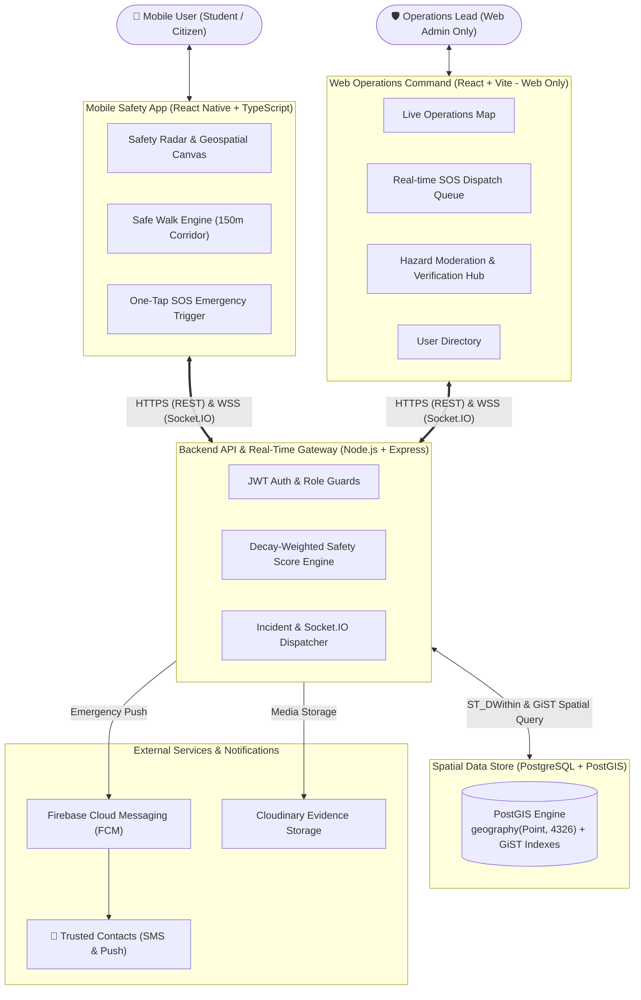

# SAFORA — Community Safety & Safe Walk App

[-61DAFB?logo=react&logoColor=black)](https://reactnative.dev)
[](https://www.typescriptlang.org/)
[](https://nodejs.org)
[](https://expressjs.com)
[](https://www.postgresql.org)
[](https://postgis.net)

> **Academic Context**: Minor Project-I submitted in partial fulfilment of the requirements for the degree of **Bachelor of Technology in Computer Science & Engineering**
> **Institution**: Dev Bhoomi Uttarakhand University (DBUU), Dehradun
> **Batch**: 2026 – 2027
> **Supervisor**: Mr. Mukesh Rajput (Assistant Professor, Department of CSE, SoEC, DBUU)
> **Project Team**: Arushi Saxena (24BTCSE0241), Anurag Suyal (24BTCSE0264), Aman Singh Kunwar (24BTCSE0321), Shubham Kumar (24BTCSE0333)

---

## 🌟 Executive Summary

**SAFORA** is a community-powered personal safety navigation and emergency response application designed for campus and urban environments. While standard navigation systems focus solely on distance and speed, SAFORA empowers walkers—especially women and students traveling at night or in unfamiliar areas—to evaluate safety risks in real time.

Users crowdsource hazard reports (poor lighting, road hazards, waterlogging, isolated areas, harassment hotspots), view an algorithmic safety score, share their journey during **Safe Walk** mode, and trigger an instant **One-Tap SOS** to trusted contacts.



> The diagram above shows the **target architecture** the project is built toward. Live location streaming to guardians and automatic server-side deviation alerts are active development work — see **[Development Status](#-development-status)** below for what's built today versus in progress.

---

## 📊 Development Status

This project follows a staged plan (`docs/v1/` → `docs/v2/` → `docs/v3/`) rather than a single big-bang build. **V1 is the version being built for this submission** and targets the six modules below; not everything in this README is live yet.

| Area | Status |
|---|---|
| Auth, hazard reporting, offline queue, safety-score calculation | ✅ Working |
| Live location streaming to guardians during Safe Walk | 🔧 In progress — see `docs/v1/tasks.md` (task 5–6) |
| Automatic server-side deviation escalation (beyond the phone-side 60s prompt) | 🔧 In progress — `docs/v1/tasks.md` (task 7) |
| Safety-score heatmap on the map screen | 🔧 In progress — `docs/v1/tasks.md` (task 8) |
| Background tracking with screen locked, lock-screen SOS audio, ETA notification | 🔧 In progress — `docs/v1/tasks.md` (tasks 13–15) |
| Admin dashboard — hazard moderation, SOS queue | ✅ Working |
| Admin "live" Safe Walk radar | 🔧 Sample-data fallback being removed — `docs/v1/tasks.md` (task 3) |
| One-tap SOS (GPS + battery + audio, FCM push, manual SMS/dialer fallback) | ✅ Working |

Full live status, file-level tasks, and acceptance tests are tracked in **[`docs/v1/tasks.md`](docs/v1/tasks.md)** — that file, not this README, is the source of truth while V1 is in progress.

---

## 📚 Project Documentation Hub

Documentation is organised into three stages, plus an archive of earlier drafts:

| Folder | Contents |
|---|---|
| 🚀 **[`docs/v1/`](docs/v1/)** | **This submission.** Architecture, API, database schema, safety algorithms, mobile features, admin panel, setup, task list, and testing/submission checklist for the current build. |
| 🗺️ **[`docs/v2/`](docs/v2/)** | Product roadmap beyond the submission: accounts hardening, real per-mode routing & voice guidance, no-unlock SOS triggers, staged chat, Hindi/Uttarakhand localisation, weather & earthquake data, security/privacy/DPDP compliance. |
| 🔭 **[`docs/v3/`](docs/v3/)** | Research notes on the synopsis's future-scope items (AI safe-route scoring, offline mesh SOS messaging, AI hazard image detection) — honestly scoped, not scheduled. |
| 🗄️ **[`docs/archive/`](docs/archive/)** | Earlier documentation drafts, kept for reference during the transition to the v1/v2/v3 structure. |
| 📄 **[Academic Synopsis PDF](docs/SAFORA_Synopsis_Formatted.pdf)** | Approved project synopsis submitted to Dev Bhoomi Uttarakhand University. |

**Start here:** [`docs/README.md`](docs/README.md) (folder index) → [`docs/v1/README.md`](docs/v1/README.md) (this submission's scope) → [`docs/v1/tasks.md`](docs/v1/tasks.md) (what's being worked on right now).

---

## 🚀 Key Features & The 6 Core Modules

Based on Section 4.2 of the [Project Synopsis](docs/SAFORA_Synopsis_Formatted.pdf). Items marked 🔧 are in active development for this submission — see [Development Status](#-development-status).

1. **Module 1: User Authentication, Onboarding & Session Management**
   - Secure stateless authentication using JSON Web Tokens (JWT) and bcrypt password hashing.
   - **4-Slide First-Install Onboarding Flow** (`OnboardingScreen.tsx`) introducing the Safety Score, Safe Walk, Instant SOS, and Community Reporting, with "Skip" and "Get Started" triggers.
   - Rehydration splash loader preventing login screen flicker on app resume; guest mode examiner bypass.
2. **Module 2: Community Hazard Reporting & Offline Queue**
   - Crowdsourced hazard pinning with category selection (lighting, construction, waterlogging, isolated trail, traffic) and severity ratings (1 to 5).
   - Anti-abuse mechanisms: rate limiting (20 report submissions per 15-minute window per user) and strict schema input validation.
   - In-memory server-side caching for nearby-hazard and safety-score queries, invalidated on new report submission.
   - **Offline Incident Queue**: stores unsubmitted hazard reports in `AsyncStorage` when internet drops, automatically syncing once connection is restored.
3. **Module 3: Safety Score & Calibrated Multi-Modal Routing**
   - Real-time score computation (0–100) combining hazard severity, distance falloff, recency exponential decay ($t_{\text{half}} = 24\text{h}$), and community confirmations. See `docs/v1/safety-algorithms.md` for the exact formula.
   - Spatial analysis endpoint via PostGIS `ST_ClusterDBSCAN` (`GET /api/reports/clusters`), grouping hazards within **~330m** for density analytics. 🔧 Rendering this as a heatmap on the map/home screens is in progress.
   - **Calibrated Multi-Modal Travel Time estimates** (Walk / 2-Wheeler / Car), based on fixed speed constants over the routed distance:
     - **Walk**: $1.60\text{ m/s}$ ($5.8\text{ km/h}$) → **~10.4 mins per 1 km**.
     - **2-Wheeler**: $8.88\text{ m/s}$ ($32\text{ km/h}$) + 20s buffer → **~2.2 mins per 1 km**.
     - **Car**: $7.22\text{ m/s}$ ($26\text{ km/h}$) + 45s buffer → **~3.0 mins per 1 km**.
   - **Known limitation**: all three modes currently route over the same street geometry (a single routing call); real per-mode route differentiation is planned for `docs/v2/`.
   - Proximity-biased local search powered by the Photon OpenStreetMap engine, with a MapTiler fallback.
4. **Module 4: Safe Walk Mode & Geospatial Canvas**
   - Server-side route-compliance monitoring along a configured 150-meter corridor.
   - **Dual-Strategy Geolocation**: high-accuracy GPS with automatic fallback to cellular triangulation.
   - **Layered basemap switcher**: dark and light themes over OpenStreetMap tiles, plus Esri World Imagery for satellite view.
   - **Note on offline tile caching**: an earlier bulk offline-tile-prefetch approach is being reworked (`docs/v2/`) to comply with OpenStreetMap's tile usage policy and to add proper attribution.
   - **Hierarchical Android hardware back navigation**: step-back through search dropdowns → hazard cards → tab history → double-tap exit on Home.
   - **Confirm-before-escalate**: on a route deviation, the walker gets a 60-second on-phone prompt before contacts are notified. 🔧 A server-side backstop (so an escalation still fires if the app is killed or the phone loses signal) and live location streaming to guardians are in progress for this submission — see `docs/v1/architecture.md` §3–§4.
5. **Module 5: Guardian SOS, Safety Alerts Center & Audio Evidence**
   - **Hybrid dispatch**:
     - *Online*: captures GPS coordinates, battery level, and up to 30 seconds of recorded audio; looks up guardians by email and dispatches Firebase push notifications.
     - *Offline fallback*: manual SMS composer pre-filled with a live Google Maps location link, and one-tap dialer fallback to trusted contacts or 112, requiring no internet connection.
   - **Guardian email verification**: shows whether an added contact is a Safora member (in-app push + audio playback) or SMS-only.
   - **Safety Alerts Center** (`NotificationScreen.tsx`): unread-count badge, GPS map links, and an embedded audio evidence player.
   - **Test SOS drills**: lets a walker rehearse the SOS flow without alerting real contacts.
   - One-tap native dialer fallback (`tel:112`, `tel:108`, `tel:1090`).
6. **Module 6: Administrative Moderation & Diagnostics**
   - Moderation workflow to mark hazard reports as active, resolved, duplicate, or fake.
   - Live system health checks and database latency diagnostics (`/api/diagnostics`).
   - 🔧 The Safe Walk radar's fallback to illustrative sample data (when no walk is active) is being replaced with a proper empty state — see `docs/v1/tasks.md` (task 3).

---

## 🛠️ Architecture & Technology Stack

| Layer | Technology | Engineering Rationale |
|---|---|---|
| **Mobile App** | React Native `0.87.1` + TypeScript | Native mobile performance with **Hermes** bytecode engine and **Fabric (New Architecture)** enabled. |
| **Spatial Canvas** | `OpenMapView.tsx` (Leaflet in a WebView) | Hardware-accelerated WebView map with a layered basemap switcher (dark/light OpenStreetMap tiles, Esri satellite imagery). |
| **Routing Engine** | OSRM + calibrated multi-modal speed constants | Real street-network route geometry with distance-based travel-time estimates per mode (see Module 3's known limitation above). |
| **State & Navigation** | Zustand + Native Stack Navigator | Fast, decoupled state management with native transitions, session hydration, and persistent AsyncStorage. |
| **Backend API** | Node.js + Express + TypeScript | Asynchronous REST API with in-memory caching for hot spatial queries and a Socket.IO WebSocket gateway. |
| **Database** | PostgreSQL 15+ with PostGIS | Uses `geography(Point, 4326)` for true ellipsoidal distance accuracy across the earth's curved surface. |
| **Spatial Indexing** | GiST (`reports_location_gist_idx`) | Efficient bounding-box search for hazard proximity lookups (`ST_DWithin`) and clustering. |
| **Notifications** | Firebase Cloud Messaging (FCM) | Push alerts for SOS dispatch; deviation-escalation push is part of this submission's in-progress work. |

Full technology deltas against the original synopsis (e.g. Leaflet vs. the synopsis's originally-named mapping library) are documented in **[`docs/v1/tech-stack.md`](docs/v1/tech-stack.md)**.

---

## 📂 Repository Structure

The project is configured as an npm workspace monorepo:

```
safora/
├── apps/
│   ├── backend/                # Express.js + TypeScript API server (Port 5000)
│   │   ├── src/
│   │   │   ├── config/         # Database pool, diagnostics, environment
│   │   │   ├── controllers/    # Route controllers (auth, reports)
│   │   │   ├── middleware/     # Auth guards, validation, rate limiting
│   │   │   ├── routes/         # Express routers (/api/auth, /api/reports)
│   │   │   └── app.ts          # Server bootstrap & Socket.IO initialization
│   │   ├── .env
│   │   └── package.json
│   │
│   ├── frontend/               # Vite + React + Tailwind Admin Console (Port 5173)
│   │   ├── src/
│   │   │   ├── components/     # Command map, dispatch console, diagnostics
│   │   │   ├── pages/          # Admin dashboard, incident moderation
│   │   │   └── services/       # Socket.IO client & API integration
│   │   ├── .env
│   │   └── package.json
│   │
│   └── mobile/                 # React Native mobile application
│       ├── android/            # Android Gradle project (New Arch, arm64-v8a ABI)
│       ├── src/
│       │   ├── screens/        # UI screens (Home, Map, SafeWalk, Profile, Auth)
│       │   ├── navigation/     # RootNavigator (Native Stack)
│       │   ├── services/       # Location engine, API client (Axios)
│       │   ├── store/          # Zustand global state
│       │   └── theme/          # Typography, colors, styles
│       ├── metro.config.js     # Monorepo resolution with extraNodeModules
│       └── package.json
│
├── packages/
│   └── shared-types/           # Shared TypeScript interfaces (User, HazardReport, etc.)
│       ├── src/
│       └── package.json
│
├── docs/                        # Technical documentation & Academic Synopsis
│   ├── v1/                      # This submission — architecture, API, DB, tasks, testing
│   ├── v2/                      # Post-submission product roadmap
│   ├── v3/                      # Research notes on synopsis future-scope items
│   ├── archive/                 # Earlier documentation drafts
│   ├── setup.md                 # Developer setup & run guide
│   ├── SAFORA_Synopsis_Formatted.pdf
│   └── README.md                # Docs folder index
│
└── README.md                    # Root repository documentation (this file)
```

---

## ⚡ Quick Start & Run Commands

### 1. Prerequisites
- **Node.js**: `v20.x` or `v22.x` & `npm`
- **PostgreSQL**: `15+` with the `postgis` extension enabled (e.g. via Neon)
- **Android SDK**: Platform 34/35, NDK `27.1.12297006`, OpenJDK 17

### 2. Dependency Installation
From the root repository:
```powershell
npm install
```

### 3. Database setup
On a **fresh** database, `initDatabase()` creates the schema automatically on first backend start. On an **existing** database, apply the V1 migration once before starting the new backend build — see [`docs/v1/database.md`](docs/v1/database.md) §7 for the exact script.

### 4. Start the Backend API
```powershell
cd apps/backend
npm run dev
```
- API Base URL: `http://localhost:5000/api`
- Health Check: `http://localhost:5000/api/health`
- Live Diagnostics: `http://localhost:5000/api/diagnostics`

Set `INTERNAL_TICK_SECRET` in `apps/backend/.env` before running — it protects the internal watchdog endpoint. See [`docs/v1/setup.md`](docs/v1/setup.md) for the full list of new V1 environment variables.

### 5. Run the Mobile App
In a second terminal:
```powershell
cd apps/mobile
npm start -- --reset-cache
```
In a third terminal:
```powershell
cd apps/mobile
npm run android
```

### 6. Build Standalone Debug APK
To package the standalone APK for physical testing without a local dev server:
```powershell
cd apps/mobile/android
.\gradlew assembleDebug
```
Compiled APK path:
`apps/mobile/android/app/build/outputs/apk/debug/app-debug.apk` *(size will change as V1's background-service work lands; last verified build was ~59 MB, optimised for arm64-v8a)*

---

## 🎯 Project Scope Boundaries

To maintain high quality within the academic timeline, strict boundaries are enforced:

- **Included in Minor Project-I Scope** (see [`docs/v1/`](docs/v1/) for the exact task list):
  - Fully functional React Native mobile application, Android.
  - Node.js/Express backend with Socket.IO real-time location streaming to guardians.
  - PostgreSQL + PostGIS spatial querying (`ST_DWithin`) and DBSCAN hazard clustering, rendered as a heatmap.
  - Safe Walk corridor compliance with both phone-side and server-side deviation escalation.
  - One-tap SOS emergency alert dispatch, with background tracking that survives a locked screen.
  - Administrative moderation and system diagnostics.
- **Planned for the post-submission product roadmap** (see [`docs/v2/`](docs/v2/)):
  - Account/session hardening, email verification, real per-mode routing with voice guidance, no-unlock SOS triggers, staged chat, Hindi/Uttarakhand localisation, weather & earthquake-aware safety scoring.
- **Explicitly Out of Scope for now** (see [`docs/v3/`](docs/v3/) for the research notes):
  - AI-based safe-route recommendation (lighting/crowd predictive models).
  - Offline Bluetooth / Wi-Fi Direct mesh communication.
  - AI image hazard detection from camera photos.
  - Hardware wearable SOS device integration.

---

## 📄 License & Academic Attribution

This project is developed as an academic Minor Project-I under the School of Engineering and Computing (SoEC), **Dev Bhoomi Uttarakhand University (DBUU)**, Dehradun. All rights reserved by the project authors and institution.