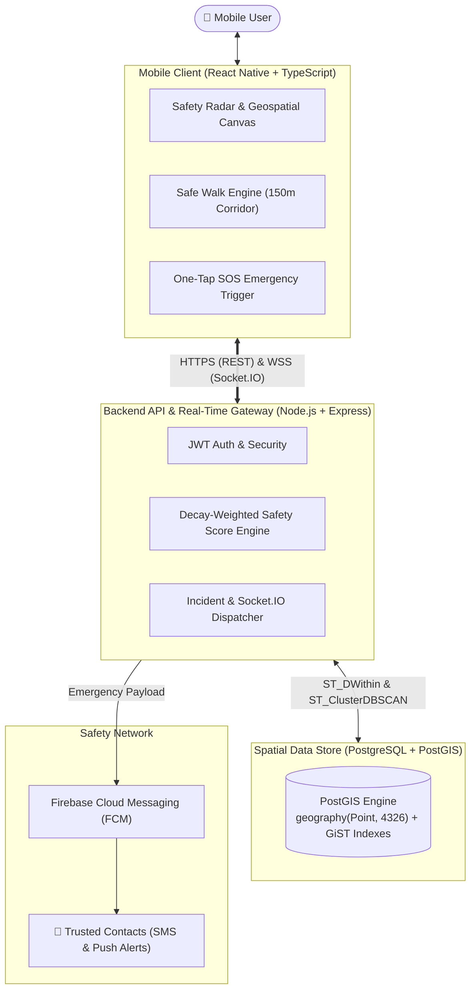

# SAFORA — Community Safety & Safe Walk App

[-61DAFB?logo=react&logoColor=black)](https://reactnative.dev)
[](https://www.typescriptlang.org/)
[](https://nodejs.org)
[](https://expressjs.com)
[](https://www.postgresql.org)
[](https://postgis.net)

> **Academic Context**: Minor Project-I submitted in partial fulfilment of the requirements for the degree of **Bachelor of Technology in Computer Science & Engineering**  
> **Institution**: Dev Bhoomi Uttarakhand University (DBUU), Dehradun  
> **Batch**: 2026 – 2027  
> **Supervisor**: Mr. Mukesh Rajput (Assistant Professor, Department of CSE, SoEC, DBUU)  
> **Project Team**: Arushi Saxena (24BTCSE0241), Anurag Suyal (24BTCSE0264), Aman Singh Kunwar (24BTCSE0321), Shubham Kumar (24BTCSE0333)

---

## 🌟 Executive Summary

**SAFORA** is a community-powered personal safety navigation and emergency response application designed for campus and urban environments. While standard navigation systems focus solely on distance and speed, SAFORA empowers walkers—especially women and students traveling at night or in unfamiliar areas—to evaluate safety risks in real time.

Users crowdsource hazard reports (poor lighting, road hazards, waterlogging, isolated areas, harassment hotspots), view an algorithmic safety heatmap, share live tracking during **Safe Walk** journeys with automated route deviation alerts, and trigger an instant **One-Tap SOS**.



---

## 📚 Project Documentation Hub

All detailed technical specifications, architectural diagrams, mathematical models, and deployment guides are available in the **[`docs/`](file:///D:/Safora/docs)** directory:

| Document | Description |
|---|---|
| 📐 **[System Architecture](file:///D:/Safora/docs/architecture.md)** | Subsystems, C4 container diagram, DFD Level 0 (Context) & Level 1, sequence flows. |
| 🔌 **[REST API Specification](file:///D:/Safora/docs/api.md)** | Endpoints reference, request/response schemas, JWT bearer authorization, and Socket.IO events. |
| 🗄️ **[Database & PostGIS Architecture](file:///D:/Safora/docs/database.md)** | ER diagram, table schemas, `geography(Point, 4326)` types, GiST indexes, and spatial query patterns. |
| 📱 **[Mobile Application Guide](file:///D:/Safora/docs/mobile-guide.md)** | React Native (Fabric/Hermes), screen catalog, Zustand state, Metro monorepo resolver, and Android APK builds. |
| 🧠 **[Safety Algorithms & Mathematics](file:///D:/Safora/docs/safety-algorithms.md)** | Mathematical safety score decay formulation, DBSCAN 50m clustering, and Safe Walk state machine. |
| 🛠️ **[Developer Setup & Run Guide](file:///D:/Safora/docs/setup.md)** | Prerequisites, `.env` file configurations, running backend & mobile, and troubleshooting. |
| 📏 **[Engineering Standards & Best Practices](file:///D:/Safora/docs/standards-and-best-practices.md)** | Codebase conventions, feature-based mobile folder structure, clean backend architecture, and PostGIS idioms. |
| 📊 **[Project Status & Roadmap](file:///D:/Safora/docs/project-status-and-roadmap.md)** | Completion progress scorecard (~94%), what is done, and remaining tasks for final submission. |
| 📑 **[Docs Master Index](file:///D:/Safora/docs/README.md)** | Comprehensive documentation index and summary of all technical artifacts. |
| 📄 **[Academic Synopsis PDF](file:///D:/Safora/docs/SAFORA_Synopsis_Formatted.pdf)** | Approved project synopsis submitted to Dev Bhoomi Uttarakhand University. |

---

## 🚀 Key Features & The 6 Core Modules

Based on Section 4.2 of the [Project Synopsis](file:///D:/Safora/docs/SAFORA_Synopsis_Formatted.pdf):

1. **Module 1: User Authentication, Onboarding & Session Management**
   - Secure stateless authentication using JSON Web Tokens (JWT) and bcrypt password hashing.
   - **4-Slide First-Install Onboarding Flow** (`OnboardingScreen.tsx`) introducing Safety Heatmap, Safe Walk, Instant SOS, and Community Alerts with "Skip" and "Get Started" triggers.
   - Rehydration splash loader preventing login screen flicker on app resume; guest mode examiner bypass.
2. **Module 2: Community Hazard Reporting & Offline Queue**
   - Crowdsourced hazard pinning with category selection (lighting, construction, waterlogging, isolated trail, traffic) and severity ratings (1 to 5).
   - Anti-abuse mechanisms: Rate limiting (max 5/hr) and text filters against personal names.
   - **Sub-2ms In-Memory RAM Caching** with automatic cache invalidation upon report submission.
   - **Offline Incident Queue**: Stores unsubmitted hazard reports in `AsyncStorage` when internet drops, automatically syncing once connection is restored.
3. **Module 3: Safety Score & Calibrated Multi-Modal Routing Engine**
   - Real-time score computation (0 to 100) combining hazard frequency, severity, recency exponential decay ($t_{\text{half}} = 24\text{h}$), and community confirmations.
   - Spatial clustering via PostGIS `ST_ClusterDBSCAN` grouping hazards within **50 meters** to prevent duplicate marker clutter.
   - **Calibrated Multi-Modal Travel Times**:
     - **Walk**: Calibrated to $1.60\text{ m/s}$ ($5.8\text{ km/h}$) $\rightarrow$ exactly **~10.4 mins per 1 km**.
     - **2-Wheeler (Bike/Scooter)**: $8.88\text{ m/s}$ ($32\text{ km/h}$) $+ 20\text{s}$ buffer $\rightarrow$ **~2.2 mins per 1 km**.
     - **Car**: $7.22\text{ m/s}$ ($26\text{ km/h}$) $+ 45\text{s}$ signal buffer $\rightarrow$ **~3.0 mins per 1 km**.
   - Proximity-biased local search powered by Photon OpenStreetMap engine + MapTiler fallback.
4. **Module 4: Safe Walk Mode, Dual GPS & Watermark-Free Offline Geospatial Canvas**
   - Live route compliance monitoring along a configured 150-meter corridor.
   - **Dual-Strategy Geolocation**: High-accuracy GPS with automatic fallback to cellular triangulation, plus continuous live watcher (`watchUserLocation`).
   - **10km Offline Map Caching**: HTML5 `CacheStorage` pre-caches surrounding 10km radius tiles for complete offline exploration.
   - **Watermark-Free & Keyless Layer Switcher**: Sleek dark slate basemap via **Esri World Dark Gray Base** (`maxNativeZoom: 16, maxZoom: 19`), Street View via **OpenStreetMap**, and high-resolution **Esri World Imagery**.
   - **Hierarchical Android Hardware Back Navigation**: Smooth step-back navigation (dismissing search dropdowns $\rightarrow$ hazard cards $\rightarrow$ tab history stack $\rightarrow$ double-tap exit protection on Home).
   - **Confirm-Before-Escalate**: If a deviation occurs, the walker receives a 60-second grace prompt before alerting contacts, eliminating false alarms.
5. **Module 5: Two-Way Guardian SOS, Safety Alerts Center & 30s Audio Player**
   - **Hybrid Dispatch Engine**:
     - *Method A (Online Primary)*: Captures GPS coordinates, battery level, and 30-second recorded audio evidence; looks up guardians by email and dispatches instant high-priority Firebase push notifications.
     - *Method B (Offline Fallback)*: Instant automated failover to direct cellular SMS with live Google Maps pin link (`https://maps.google.com/?q=...`) to contacts or 112 without requiring internet.
   - **Smart Contact Email Verification**: Input fields for Name, Phone, and Email with real-time verification against the database to show 🟢 *Safora Member (In-App Alerts & 30s Audio Enabled)* vs 📱 *Direct SMS Only*.
   - **Dedicated Safety Alerts Center (`NotificationScreen.tsx`)**: Accessible via the `🔔` Bell icon in the Profile header (with live unread counter badge), featuring card views, live GPS map buttons, and an embedded **30-second live audio evidence player** with animated waveforms.
   - **Interactive Safety Drills**: Upgraded "Test SOS" allowing walkers and guardians to test in-app alerts beforehand with zero panic.
   - One-tap native telephone dialer fallback (`tel:112`, `tel:108`, `tel:1090`).
6. **Module 6: Administrative Moderation & Diagnostics**
   - Moderation workflows to mark reports as active, resolved, duplicate, or fake.
   - Live system health checks and database latency diagnostics (`/api/diagnostics`).

---

## 🛠️ Architecture & Technology Stack

| Layer | Technology | Engineering Rationale |
|---|---|---|
| **Mobile App** | React Native `0.87.1` + TypeScript | Native mobile performance with **Hermes** bytecode engine and **Fabric (New Architecture)** enabled. |
| **Spatial Canvas** | Open Geospatial Canvas (`OpenMapView.tsx`) | Leaflet-powered hardware-accelerated WebView with 10km offline tile caching (`CacheStorage`) and multi-layer switcher (Esri Satellite, OSM Street, MapTiler Default). |
| **Routing Engine** | OSRM + Calibrated Multi-Modal Matrix | Real street-network polylines with human-accurate pedestrian walking speed ($1.60\text{ m/s}$) and 2-wheeler/car estimates. |
| **State & Navigation** | Zustand + Native Stack Navigator | Fast, decoupled state management with native transitions, session hydration, and persistent AsyncStorage. |
| **Backend API** | Node.js + Express + TypeScript | Lightweight asynchronous REST API with in-memory RAM caching (<2ms responses) and Socket.IO WebSocket gateway. |
| **Database** | PostgreSQL 15+ with PostGIS | Uses `geography(Point, 4326)` for true ellipsoidal distance accuracy across the earth's curved surface. |
| **Spatial Indexing** | GiST (`reports_location_gist_idx`) | $O(\log N)$ bounding-box search for high-throughput spatial radius lookups (`ST_DWithin`). |
| **Notifications** | Firebase Cloud Messaging (FCM) v14 | High-priority push alerts for deviation escalation and SOS dispatch. |

---

## 📂 Repository Structure

The project is configured as an npm workspace monorepo:

```
safora/
├── apps/
│   ├── backend/                # Express.js + TypeScript API server
│   │   ├── src/
│   │   │   ├── config/         # Database pool, diagnostics, environment
│   │   │   ├── controllers/    # Route controllers (auth, reports)
│   │   │   ├── middleware/     # Auth guards, validation, rate limiting
│   │   │   ├── routes/         # Express routers (/api/auth, /api/reports)
│   │   │   └── app.ts          # Server bootstrap & Socket.IO initialization
│   │   ├── .env
│   │   └── package.json
│   │
│   └── mobile/                 # React Native mobile application
│       ├── android/            # Android Gradle project (New Arch, arm64-v8a ABI)
│       ├── src/
│       │   ├── screens/        # UI screens (Home, Map, SafeWalk, Profile, Auth)
│       │   ├── navigation/     # RootNavigator (Native Stack)
│       │   ├── services/       # Location engine, API client (Axios)
│       │   ├── store/          # Zustand global state
│       │   └── theme/          # Typography, colors, styles
│       ├── metro.config.js     # Monorepo resolution with extraNodeModules
│       └── package.json
│
├── packages/
│   └── shared-types/           # Shared TypeScript interfaces (User, HazardReport, etc.)
│       ├── src/
│       └── package.json
│
├── docs/                       # Technical documentation & Academic Synopsis
│   ├── architecture.md
│   ├── api.md
│   ├── database.md
│   ├── mobile-guide.md
│   ├── safety-algorithms.md
│   ├── setup.md
│   ├── SAFORA_Synopsis_Formatted.pdf
│   └── README.md
│
└── README.md                   # Root repository documentation
```

---

## ⚡ Quick Start & Run Commands

### 1. Prerequisites
- **Node.js**: `v20.x` or `v22.x` & `npm`
- **PostgreSQL**: `15+` with the `postgis` extension enabled (e.g. via Neon)
- **Android SDK**: Platform 34/35, NDK `27.1.12297006`, OpenJDK 17

### 2. Dependency Installation
From the root repository:
```powershell
npm install
```

### 3. Start the Backend API
```powershell
cd apps/backend
npm run dev
```
- API Base URL: `http://localhost:5000/api`
- Health Check: `http://localhost:5000/api/health`
- Live Diagnostics: `http://localhost:5000/api/diagnostics`

### 4. Run the Mobile App
In a second terminal:
```powershell
cd apps/mobile
npm start -- --reset-cache
```
In a third terminal:
```powershell
cd apps/mobile
npm run android
```

### 5. Build Standalone Debug APK
To package the standalone APK for physical testing without a local dev server:
```powershell
cd apps/mobile/android
.\gradlew assembleDebug
```
Compiled APK path:  
`apps/mobile/android/app/build/outputs/apk/debug/app-debug.apk` *(~59 MB, optimized for arm64-v8a)*

---

## 🎯 Project Scope Boundaries

To maintain high quality within the academic timeline, strict boundaries are enforced:

- **Included in Minor Project-I Scope**:
  - Fully functional React Native mobile application.
  - Node.js/Express backend with Socket.IO real-time location streaming.
  - PostgreSQL + PostGIS spatial querying (`ST_DWithin`) and 50m DBSCAN hazard clustering.
  - Safe Walk corridor compliance and 60-second deviation escalation.
  - One-tap SOS emergency alert dispatch.
  - Administrative moderation and system diagnostics.
- **Explicitly Out of Scope (Future Major Project)**:
  - AI-based safe-route recommendation (lighting/crowd/weather predictive models).
  - Offline Bluetooth / Wi-Fi Direct mesh communication.
  - AI image hazard detection from camera photos.
  - Hardware wearable SOS device integration.

---

## 📄 License & Academic Attribution

This project is developed as an academic Minor Project-I under the School of Engineering and Computing (SoEC), **Dev Bhoomi Uttarakhand University (DBUU)**, Dehradun. All rights reserved by the project authors and institution.
