# SAFORA — Admin Web Panel Architecture & Technical Specification

This document provides the standard architectural specification, technical research, technology choices, feature modules, and implementation plan for the **SAFORA Admin Web Panel & Operations Command Center**.

---

## 1. Executive Summary

While the **SAFORA Mobile Application** serves citizens, students, and walking pedestrians on the ground, the **Admin Web Panel** serves campus security personnel, university administrators, civic authorities, and system operators.

### Core Objectives:
1. **Real-Time Situation Awareness**: Live operations map displaying active Safe Walks, hazard clusters, and pulsing emergency SOS beacons.
2. **Emergency Response Dispatch**: Instant queue for inbound SOS alerts with live GPS tracking, battery telemetry, and 30-second Cloudinary ambient audio evidence playback.
3. **Crowdsourced Hazard Moderation**: Review, approve, resolve, or flag duplicate/fake community hazard reports with photo evidence inspection.
4. **Safety Intelligence & Spatial Analytics**: Incident density analysis, campus safety heatmap scoring, and category breakdowns.
5. **System Health & Observability**: Real-time monitoring of PostGIS spatial queries, Render backend latency, Cloudinary storage, and Firebase dispatch.

---

## 2. Monorepo Integration & Project Placement

The project is placed inside the existing npm monorepo workspace at:
```
D:\Safora\apps\frontend\
```

### Workspace Hierarchy:
```
D:\Safora/
├── apps/
│   ├── backend/                  # Express.js + PostGIS + Socket.IO + Cloudinary
│   ├── mobile/                   # React Native (Android) Mobile App
│   └── frontend/                 # [NEW] React + Vite Admin Operations Web Panel
├── packages/
│   └── shared-types/             # Shared TypeScript models (User, HazardReport, SosAlert, etc.)
└── docs/                         # Technical documentation & architectural specs
```

### Key Advantages of `apps/frontend/`:
- **Direct Model Sharing**: Imports types directly from `@safora/shared-types` (`User`, `HazardReport`, `SosAlert`, `Journey`, `ApiResponse`) with zero duplication.
- **Independent Build Pipeline**: Can be built independently with `npm run build --workspace=apps/frontend` and deployed to any static hosting provider (Vercel, Netlify, Render Static Site, or AWS S3/CloudFront).

---

## 3. Technology Stack & CSS Strategy Analysis

### 3.1 Framework & Core Tooling

| Component | Choice | Rationale |
|---|---|---|
| **Framework** | **React 19 + Vite** | Extremely fast Hot Module Replacement (HMR), lightweight bundle size (~250 KB gzip), native ES modules, and zero-configuration asset pipeline. |
| **Language** | **TypeScript 5.x** | End-to-end type safety shared with backend and mobile. |
| **Styling** | **Tailwind CSS + Custom CSS Matrix Engine** | Rapid utility layouts paired with obsidian glassmorphism tokens and CSS filters (`.dark-matrix-tiles`). |
| **Routing** | **React Router DOM v6** | Declarative client-side routing with route protection guards and layout nesting. |
| **Real-Time** | **Socket.IO Client 4.x** | Bi-directional WebSocket communication with the backend (`server.js`) for instant emergency SOS alerts and live location updates. |
| **Spatial Map** | **Leaflet + React-Leaflet** | 4-mode tactical canvas (Dark Matrix, Tactical Gray, Satellite, Street Map) with global boundary locking (`noWrap`). |
| **Charts** | **Recharts** | Declarative SVG-based charting for safety analytics, incident volumes, and response time metrics. |
| **HTTP Client** | **Axios** | Centralized API client with JWT authentication interceptors and automatic error handling. |

---

### 3.2 Styling Strategy: Pure Vanilla CSS vs. Mixing Tailwind CSS

A critical design choice for the web application is the CSS architecture:

#### Option A: Pure Vanilla CSS with Modern CSS Variables & CSS Modules (Recommended)
- **How it works**: Uses global design tokens in `src/index.css` (color scales, typography, spacing, glassmorphism filters, animations) combined with scoped CSS Modules (`Dashboard.module.css`).
- **Pros**:
  - **100% Control**: Pixel-perfect tactical command center aesthetics (deep obsidian `#070A11`, glowing radar beacons, backdrop-filter glassmorphism).
  - **Zero Build Tooling Headaches**: No PostCSS configuration conflicts or Tailwind version mismatch in the monorepo.
  - **Zero CSS Runtime & Tiny Footprint**: Zero unused utility bloat.
  - **Clean JSX**: Code remains readable without 15-class-long utility strings on every `<div>`.
- **Cons**: Requires writing structured CSS rules for reusable components.

#### Option B: Tailwind CSS Utility Engine
- **How it works**: Utility-first classes (e.g., `flex items-center gap-4 bg-slate-900 border border-slate-800 rounded-xl`).
- **Pros**: Rapid prototyping for common layouts and standard flex/grid positioning.
- **Cons**:
  - Custom animations (e.g., complex multi-ring radar pulses, sound wave visualizers, Leaflet map overlays) still require custom CSS rules.
  - In large dashboards, JSX markup can become verbose with dozens of utility class names.

#### Recommendation:
**Use Modern Vanilla CSS with Scoped CSS Modules & CSS Custom Properties**. It gives the admin panel a distinctive, bespoke, high-end "military/tactical operations" feel rather than looking like a generic template. However, if your team strongly prefers Tailwind utility classes for speed, **Tailwind CSS v3** can be seamlessly integrated.

---

## 4. Feature Specifications

```mermaid
graph TD
    Panel["SAFORA Admin Operations Command"]
    
    Panel --> Dash["1. Tactical Live Dashboard"]
    Dash --> D1["Live KPI Cards (Active SOS, Active Walks, Open Hazards, PostGIS Status)"]
    Dash --> D2["Live Geospatial Canvas (Pulsing SOS markers, Hazard pins, Safe Walk lines)"]
    Dash --> D3["Emergency Alert Banner (Audio siren chime + flashing red banner on new SOS)"]

    Panel --> SOS["2. Emergency SOS Command Queue"]
    SOS --> S1["Real-time SOS Dispatch Table with GPS & Battery Telemetry"]
    SOS --> S2["Embedded 30-Second Cloudinary Ambient Audio Evidence Player"]
    SOS --> S3["Dispatcher Workflow (Dispatched -> Acknowledged -> Resolved)"]

    Panel --> Haz["3. Hazard & Incident Moderation"]
    Haz --> H1["Multi-criteria filtering (Category, Severity 1-5, Status)"]
    Haz --> H2["Cloudinary Hazard Photo Inspector Modal with Zoom"]
    Haz --> H3["One-click moderation (Verify, Resolve, Mark Fake, Mark Duplicate)"]

    Panel --> Walk["4. Safe Walk Live Radar"]
    Walk --> W1["Real-time walking journey tracking"]
    Walk --> W2["150m corridor deviation alerts & ETA countdown"]

    Panel --> Analytics["5. Safety Intelligence & Heatmap"]
    Analytics --> A1["High-risk corridor density charts"]
    Analytics --> A2["Incident category distribution (Lighting, Road, Isolated)"]
    Analytics --> A3["Resolution SLA & response time metrics"]

    Panel --> Diag["6. System Health Console"]
    Diag --> DG1["PostgreSQL + PostGIS Connection & Query Latency"]
    Diag --> DG2["Cloudinary API & Media Vault Status"]
    Diag --> DG3["Firebase Admin SDK & WebSocket Health"]
    Diag --> DG4["MapTiler Telemetry & External Connectivity"]
```



### 4.1 Geospatial Operations Canvas Architecture (`LiveCommandMap.tsx`)
The command center's centerpiece is a hardware-accelerated spatial map built on Leaflet and `@safora/shared-types`:

#### 1. 4-Tier Tactical Basemap Switcher:
- ⚡ **Dark Matrix (Default)**: High-tech cyber defense theme created by applying a hardware-accelerated CSS inversion filter (`.dark-matrix-tiles`) directly to OpenStreetMap tiles:
  ```css
  .dark-matrix-tiles .leaflet-tile {
    filter: invert(100%) hue-rotate(180deg) brightness(88%) contrast(95%) !important;
  }
  ```
  This creates an ultra-sleek, deep obsidian look with high-contrast road grids and zero watermarks.
- 🛡️ **Tactical Gray**: Esri World Dark Gray Canvas (`ArcGIS/rest/services/Canvas/World_Dark_Gray_Base/MapServer`).
- 🛰️ **Satellite View**: Esri World Imagery (`ArcGIS/rest/services/World_Imagery/MapServer`).
- 🛣️ **Street Map**: Clean OpenStreetMap standard navigation view.

#### 2. Anti-Duplication & Infinite Wrap Prevention:
To prevent Leaflet from repeating the world map infinitely across the horizontal axis when zoomed out:
- **`TileLayer`**: Configured with `noWrap={true}` and `bounds={[[-85, -180], [85, 180]]}`.
- **`MapContainer`**: Configured with `minZoom={3}`, `maxBounds={[[-85, -180], [85, 180]]}`, `maxBoundsViscosity={1.0}`, and `worldCopyJump={false}`. This guarantees that panning and zooming remain strictly locked inside true planetary coordinates without duplicated continents.

#### 3. Keyless & Zero-Quota Tile Pipeline:
Neither the Web Admin Panel nor the Mobile App relies on MapTiler API keys for base tile rendering. Both utilize open, keyless providers (OSM with CSS filters and Esri World Services), ensuring:
- **Zero Watermarks**: No commercial watermark branding covering operational screens.
- **Zero Quota Exhaustion**: Maps never fail or freeze due to monthly request limit overruns.

### 4.2 System Health & External Service Telemetry (`DiagnosticsPage.tsx`)
The Admin Panel features a dedicated diagnostics dashboard querying `GET /api/diagnostics`:
- **PostgreSQL & PostGIS**: Latency, connection pool health, and spatial function verification.
- **Cloudinary Media Vault**: Signed upload credentials and media storage availability.
- **Firebase Admin SDK**: Push notification dispatch service reachability.
- **MapTiler Telemetry**: Verifies whether `MAPTILER_API_KEY` in `apps/backend/.env` is valid by pinging `streets-v2/style.json`. *(Note: This key is used strictly for diagnostics reachability telemetry and optional mobile geocoding fallback, not for tile display).*
- **Render Backend Infrastructure**: Host uptime, environment version, and active Socket.IO listener count.

---

## 5. Standard Project Directory Structure (`apps/frontend`)

```
apps/frontend/
├── index.html                        # HTML5 entry with Google Inter/Outfit fonts
├── package.json                      # React, Vite, Leaflet, Recharts, Socket.IO
├── tsconfig.json                     # TypeScript strict configuration
├── tsconfig.node.json                # Vite tooling TypeScript configuration
├── vite.config.ts                    # Vite build configuration with @/ path aliases
├── public/
│   ├── favicon.ico
│   ├── logo.svg
│   └── sounds/
│       └── emergency-beacon.mp3      # Audio chime on inbound SOS
└── src/
    ├── main.tsx                      # Application bootstrap & DOM mount
    ├── App.tsx                       # Root router & layout wrapper
    ├── index.css                     # Global CSS variables, reset, design tokens
    ├── assets/                       # SVG icons, brand artwork
    ├── components/
    │   ├── common/                   # Reusable UI Primitives
    │   │   ├── Navbar.tsx            # Top command bar with live UTC/IST clock
    │   │   ├── Sidebar.tsx           # Collapsible tactical navigation drawer
    │   │   ├── StatCard.tsx          # Metric card with glowing borders & delta
    │   │   ├── Badge.tsx             # Semantic pills (Active, Resolved, Fake)
    │   │   ├── Button.tsx            # Primary, danger, outline buttons
    │   │   ├── Modal.tsx             # Accessible backdrop-filter dialog
    │   │   └── AudioPlayer.tsx       # 30s Cloudinary audio evidence player
    │   ├── map/                      # Spatial Leaflet Components
    │   │   ├── LiveCommandMap.tsx    # Leaflet canvas with Esri dark mode tiles
    │   │   ├── HazardMarker.tsx      # SVG category marker with popup card
    │   │   ├── SosBeacon.tsx         # Pulsing concentric radar circles
    │   │   └── SafeWalkCorridor.tsx  # Polyline with 150m buffer corridor
    │   └── emergency/
    │       └── SosBannerAlert.tsx    # Persistent top-of-screen alert drawer
    ├── pages/                        # Screen Views
    │   ├── DashboardPage.tsx         # Combined command view (Map + KPIs + Queue)
    │   ├── SosAlertsPage.tsx         # Dedicated emergency response management
    │   ├── HazardsPage.tsx           # Moderation data table with photo viewer
    │   ├── SafeWalksPage.tsx         # Live journey radar & deviation logs
    │   ├── AnalyticsPage.tsx         # Recharts safety metrics & heatmaps
    │   ├── UsersPage.tsx             # Registered users & emergency guardians
    │   ├── DiagnosticsPage.tsx       # Live visual display of /api/diagnostics
    │   └── LoginPage.tsx             # Operator authentication screen
    ├── services/                     # Backend API & Real-time Client
    │   ├── api.ts                    # Axios client instance with auth interceptor
    │   ├── authService.ts            # Admin login, session check, token refresh
    │   ├── reportService.ts          # Hazard fetching, moderation, confirmations
    │   ├── sosService.ts             # SOS query, acknowledgment, resolution
    │   ├── journeyService.ts         # Safe Walk journey tracking records
    │   └── socketService.ts          # Socket.IO client instance & event listeners
    ├── context/                      # React Context Providers
    │   ├── AuthContext.tsx           # Logged-in admin session & permissions
    │   └── SocketContext.tsx         # Real-time WebSocket subscriptions
    ├── types/                        # Local UI types (Table filters, pagination)
    │   └── ui.ts
    └── utils/                        # Pure Helper Functions
        ├── formatters.ts             # Timeago, GPS coordinates formatting
        └── constants.ts              # Status colors, categories, tile URLs
```

---

## 6. Backend API & WebSocket Communication Protocol

The Admin Panel integrates directly with the existing backend endpoints:

### 6.1 REST Endpoints

| Endpoint | Method | Role / Action | Backend Handler |
|---|---|---|---|
| `/api/auth/login` | `POST` | Operator login | `authController.login` |
| `/api/auth/me` | `GET` | Validate operator session | `authController.getProfile` |
| `/api/reports` | `GET` | Fetch all reports with query filters | `reportController.getReports` |
| `/api/reports/nearby` | `GET` | Fetch reports in spatial radius | `reportController.getNearbyReports` |
| `/api/reports/safety-score` | `GET` | Calculate live safety score | `reportController.getSafetyScore` |
| `/api/reports/:id/moderate` | `PATCH` | Update report status (`active`, `resolved`, `fake`) | `reportController.moderateReport` |
| `/api/sos` | `GET` / `POST` | Query active SOS alerts / trigger emergency | `sosController.triggerSOS` |
| `/api/journeys` | `GET` | Fetch active and past Safe Walks | `journeyController` |
| `/api/notifications` | `GET` | Fetch safety notifications stream | `notificationController` |
| `/api/diagnostics` | `GET` | Real-time system health & DB latency | `config/diagnostics.ts` |

### 6.2 WebSocket (Socket.IO) Events

```
[Citizen Mobile App]                     [SAFORA Backend]                     [Admin Web Panel]
        │                                       │                                     │
        ├────── journey:sos_triggered ─────────>│                                     │
        │                                       ├────── sos:dispatched ──────────────>│ (Audio siren plays)
        │                                       │                                     │ (Pulsing beacon on map)
        │                                       │                                     │
        ├────── journey:location_update ───────>│                                     │
        │                                       ├────── journey:update ──────────────>│ (Live marker moves)
        │                                       │                                     │
        ├────── journey:deviation_alert ───────>│                                     │
        │                                       ├────── corridor:breached ───────────>│ (Orange alert banner)
```

---

## 7. UI Design Tokens & Theme Specification

### 7.1 Dark Palette (Command Center Theme)
```css
:root {
  /* Surface & Background */
  --bg-primary: #070A11;       /* Deep obsidian base */
  --bg-secondary: #0E1424;     /* Elevated card container */
  --bg-tertiary: #172033;      /* Interactive hover states */
  --border-color: rgba(255, 255, 255, 0.08);
  --border-focus: rgba(99, 102, 241, 0.5);

  /* Brand Accents */
  --accent-primary: #6366F1;   /* Electric Indigo */
  --accent-glow: rgba(99, 102, 241, 0.25);
  
  /* Emergency Status Colors */
  --color-danger: #EF4444;     /* Red SOS Alert */
  --color-danger-glow: rgba(239, 68, 68, 0.3);
  --color-warning: #F59E0B;    /* Amber Moderation / Corridor Warning */
  --color-success: #10B981;    /* Emerald Resolved / Safe */
  --color-info: #06B6D4;       /* Cyan Radar */

  /* Typography */
  --text-primary: #F9FAFB;
  --text-secondary: #9CA3AF;
  --text-muted: #6B7280;
  --font-sans: 'Inter', -apple-system, BlinkMacSystemFont, 'Segoe UI', Roboto, sans-serif;
  --font-mono: 'JetBrains Mono', 'Fira Code', monospace;
}
```

---

## 8. Implementation Status & Operational Modules

All 7 core architectural phases of the Admin Web Panel are **100% Complete, Integrated, and Operational**:

| Phase | Description | Deliverables | Status |
|---|---|---|:---:|
| **Phase 1: Project Initialization** | Initialized `apps/frontend` using Vite + React 19 + TypeScript. Implemented design system tokens, obsidian glassmorphism, and Axios API client with JWT interceptor. | Clean build, workspace linking, dark mode tokens. | ✅ **100% Live** |
| **Phase 2: Common Components & Layout** | Built responsive shell with `Navbar`, collapsible `Sidebar`, live UTC/IST clock, `StatCard`, semantic `Badge`, and accessible `Modal`. | Responsive command center layout. | ✅ **100% Live** |
| **Phase 3: Live Geospatial Command Map** | Built `LiveCommandMap.tsx` featuring 4 tactical layers (⚡ Dark Matrix, 🛡️ Tactical Gray, 🛰️ Satellite, 🛣️ Street Map), infinite horizontal world duplication lock (`noWrap`, `maxBounds`), pulsing SOS beacons, and hazard pins. | Real-time tactical geospatial canvas. | ✅ **100% Live** |
| **Phase 4: Emergency SOS Command Queue** | Built `SosAlertsPage.tsx` with live GPS telemetry, battery percentage, responder acknowledge/resolve controls, and embedded Cloudinary ambient audio player. | High-priority SOS dispatch workflow. | ✅ **100% Live** |
| **Phase 5: Hazard Moderation Console** | Built `HazardsPage.tsx` with multi-category filters, 12+ Indian metro preset focus, status filtering (`active`, `resolved`, `fake`), and Cloudinary Photo Inspector modal. | One-click community incident moderation. | ✅ **100% Live** |
| **Phase 6: Real-Time WebSocket Pipeline** | Built `SocketContext.tsx` with Socket.IO client streaming `sos:dispatched`, `journey:update`, and `corridor:breached` with audio siren chimes. | Zero-latency situational awareness banner. | ✅ **100% Live** |
| **Phase 7: Analytics & System Diagnostics** | Built `AnalyticsPage.tsx` (Recharts safety charts) and `DiagnosticsPage.tsx` (real-time telemetry for PostGIS, Cloudinary, Firebase, and MapTiler). | Health observability and safety trends. | ✅ **100% Live** |
