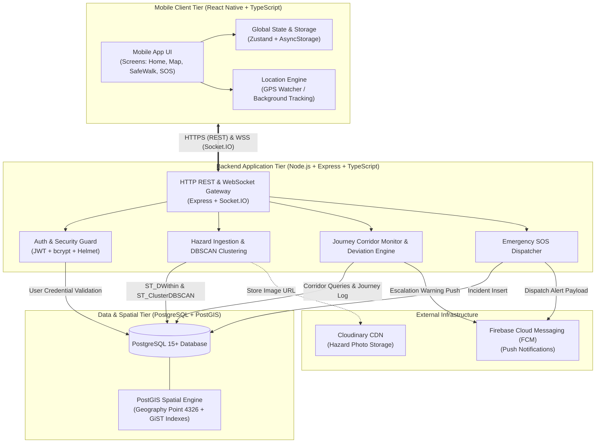
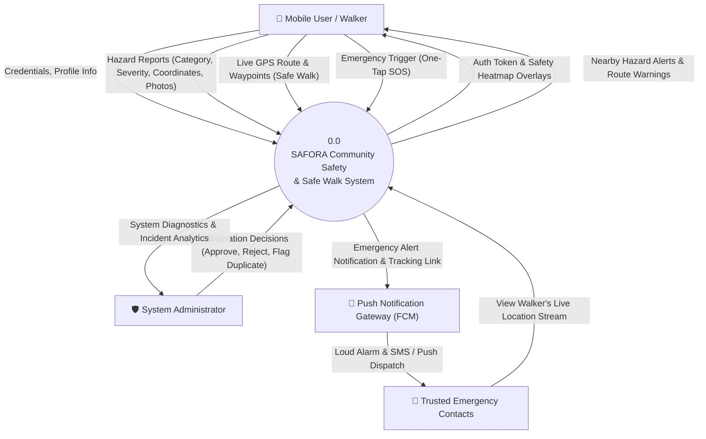
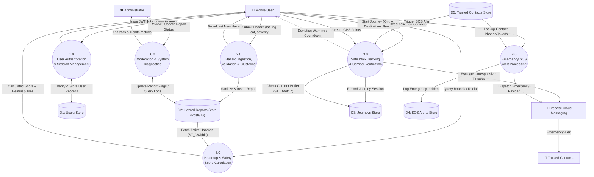
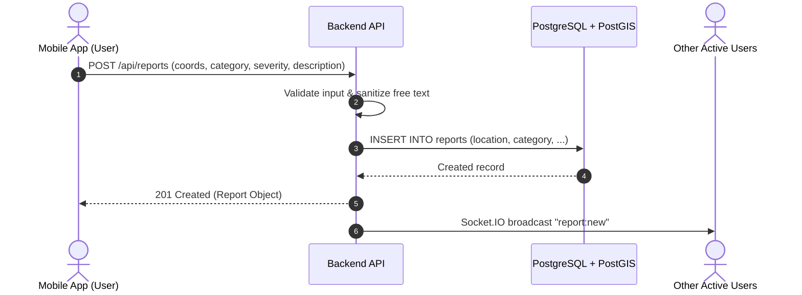
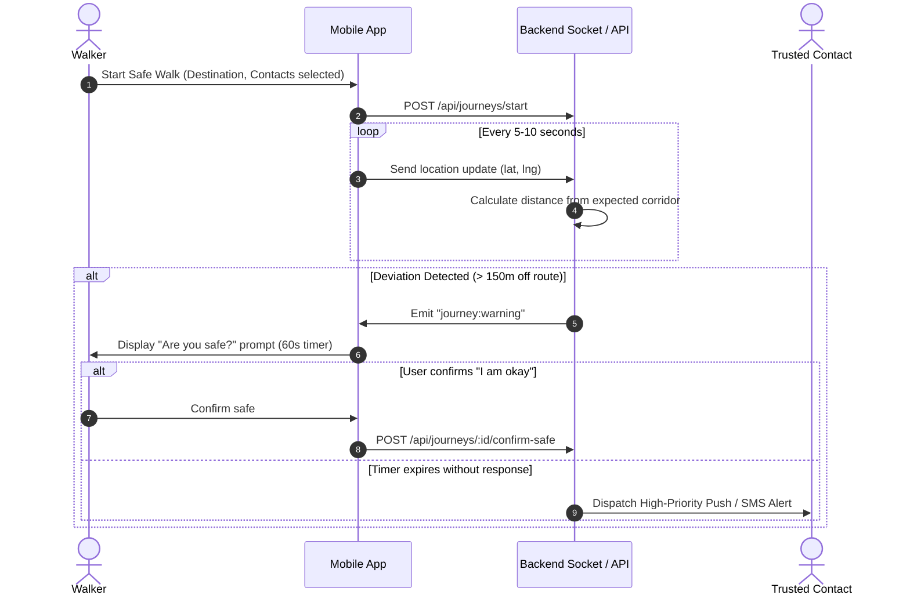
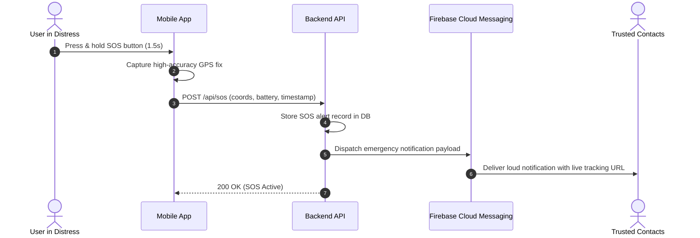

# SAFORA — System Architecture Document

## 1. Executive Overview

**SAFORA** is a community-driven safety and emergency assistance platform tailored for urban and campus environments. It empowers individuals through:
- **Crowdsourced Hazard Reporting**: Real-time reporting of infrastructure and safety hazards (e.g., poor lighting, road hazards, waterlogging, harassment hotspots).
- **Safety Heatmaps**: PostGIS-powered geospatial scoring indicating risk levels in real time.
- **Safe Walk Mode**: Live journey tracking with intelligent route deviation detection and automated escalation.
- **One-Tap Emergency SOS**: Instant location broadcasting to trusted contacts and responders.



---

## 2. Monorepo Structure

The project is managed as an npm workspace monorepo:

```
safora/
├── apps/
│   ├── backend/                # Express + TypeScript API server
│   │   ├── src/
│   │   │   ├── config/         # Database pool, diagnostics, environment
│   │   │   ├── controllers/    # Route controllers (auth, reports)
│   │   │   ├── middleware/     # Auth guards, validation, rate limiting
│   │   │   ├── routes/         # Express routers
│   │   │   └── app.ts          # Server bootstrap & Socket.IO initialization
│   │   └── package.json
│   │
│   └── mobile/                 # React Native mobile application
│       ├── android/            # Android native Gradle project (New Arch / Fabric)
│       ├── src/
│       │   ├── screens/        # UI screens (Home, Map, SafeWalk, Profile, Auth)
│       │   ├── navigation/     # RootNavigator (Native Stack)
│       │   ├── services/       # API client (Axios), location service
│       │   ├── store/          # Global state (Zustand)
│       │   └── theme/          # Typography, colors, spacing
│       └── package.json
│
├── packages/
│   └── shared-types/           # Shared TypeScript contracts & interfaces
│       ├── src/
│       │   └── index.ts        # User, HazardReport, TrustedContact
│       └── package.json
│
└── docs/                       # Technical documentation & project blueprints
```

---

## 3. Core Subsystems

### 3.1 Mobile Client Subsystem
- **Engine**: React Native 0.87.1 running the **Hermes** JavaScript engine with **New Architecture (Fabric)** enabled.
- **State Management**: **Zustand** stores for lightweight, decoupled authentication and active journey state.
- **Mapping & Geolocation**:
  - `react-native-maps` for interactive vector map rendering.
  - Native geolocation providers for coordinate retrieval and live coordinate streaming.
- **Navigation**: `@react-navigation/native-stack` offering native platform transitions between onboarding, authentication, and core safety features.

### 3.2 Backend API & Real-Time Gateway
- **Framework**: Express.js with strict TypeScript compilation.
- **Security & Headers**: `helmet` for secure HTTP headers, `cors` configured for mobile API clients.
- **Real-Time Layer**: `socket.io` for bi-directional streaming of live walker coordinates and real-time hazard updates.
- **Authentication**: Stateless JSON Web Tokens (`jsonwebtoken`) with salted `bcryptjs` password hashing.

### 3.3 Database & Spatial Layer
- **Engine**: PostgreSQL 15+ with the **PostGIS** extension.
- **Coordinate Handling**: Geospatial points stored using `geography(Point, 4326)` for geodetic, spheroidal calculations without planar distortion.
- **Spatial Indexing**: GiST indexes on spatial columns for high-throughput $O(\log N)$ bounding-box and radius queries (`ST_DWithin`).

---

## 4. Data Flow Diagrams (DFD)

### 4.1 DFD Level 0 — System Context Diagram

The Level 0 context diagram models the information boundary between external entities and the central SAFORA system.



---

### 4.2 DFD Level 1 — Decomposed Functional System Diagram

The Level 1 DFD decomposes the system into core operational processes and shows their read/write interactions with PostGIS data stores.



---

## 5. Architectural Sequence Flows

### 5.1 Hazard Reporting & Distribution Flow



### 5.2 Safe Walk & Deviation Alerting Flow



### 5.3 Emergency One-Tap SOS Flow



---

## 6. Security & Privacy Considerations

1. **Ephemeral Journey Data**: Location history collected during Safe Walk is strictly used for route compliance and is purged or anonymized once the journey is marked `completed` or `cancelled`.
2. **Contact Protection**: Trusted contact phone numbers and notifications are transmitted over TLS; contacts receive temporary tracking links that expire when the session finishes.
3. **Abuse Mitigation**:
   - Rate limiting on report submissions to prevent spam.
   - Text filtering on user-submitted hazard descriptions to block personal identification or doxxing.
   - Confidence scoring: unverified single reports require community confirmation before affecting primary safety scores.
