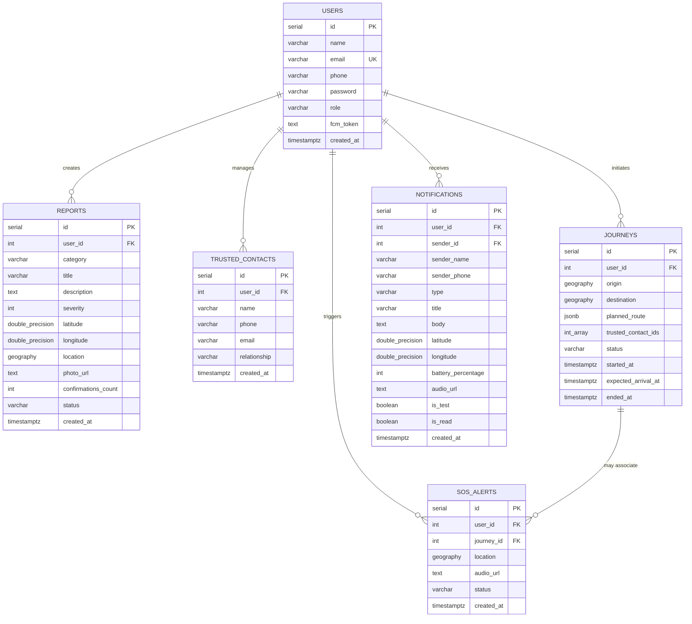

# SAFORA — Database & PostGIS Architecture

This document describes the PostgreSQL database schema, PostGIS geospatial configuration, spatial indexes, and key SQL query patterns powering SAFORA.

## 1. Overview & Spatial Rationale

SAFORA utilizes **PostgreSQL 15+** with the **PostGIS** extension.

### Why `geography(Point, 4326)`?
Geospatial coordinates in SAFORA are modeled using the `geography` type rather than planar `geometry`:
- **Real-World Spherical Accuracy**: Calculations (such as distances in meters) are computed across the curved surface of the earth (WGS 84 ellipsoid, SRID 4326).
- **No Coordinate Reprojection**: Distances can be queried natively in meters without having to project coordinates into local UTM zones.

---

## 2. Entity-Relationship Model



---

## 3. Core Tables & DDL Specification

### 3.1 Enabling PostGIS
```sql
CREATE EXTENSION IF NOT EXISTS postgis;
```

### 3.2 Users Table
```sql
CREATE TABLE IF NOT EXISTS users (
    id SERIAL PRIMARY KEY,
    name VARCHAR(150) NOT NULL,
    email VARCHAR(255) UNIQUE NOT NULL,
    phone VARCHAR(50),
    password VARCHAR(255) NOT NULL,
    role VARCHAR(50) DEFAULT 'user',
    created_at TIMESTAMP WITH TIME ZONE DEFAULT CURRENT_TIMESTAMP
);
```

### 3.3 Hazard Reports Table
```sql
CREATE TABLE IF NOT EXISTS reports (
    id SERIAL PRIMARY KEY,
    user_id INTEGER REFERENCES users(id) ON DELETE SET NULL,
    category VARCHAR(100) NOT NULL,
    title VARCHAR(200) NOT NULL,
    description TEXT,
    severity INTEGER NOT NULL CHECK (severity >= 1 AND severity <= 5),
    latitude DOUBLE PRECISION NOT NULL,
    longitude DOUBLE PRECISION NOT NULL,
    -- Generated or synced geography point
    location GEOGRAPHY(Point, 4326) GENERATED ALWAYS AS (
        ST_SetSRID(ST_MakePoint(longitude, latitude), 4326)::geography
    ) STORED,
    photo_url TEXT,
    confirmations_count INTEGER DEFAULT 0,
    status VARCHAR(50) DEFAULT 'active', -- active, resolved, duplicate, fake
    created_at TIMESTAMP WITH TIME ZONE DEFAULT CURRENT_TIMESTAMP
);

-- Spatial GiST index for fast radius searches
CREATE INDEX IF NOT EXISTS reports_location_gist_idx ON reports USING GIST (location);
CREATE INDEX IF NOT EXISTS reports_status_idx ON reports (status);
```

### 3.4 Trusted Contacts Table
```sql
CREATE TABLE IF NOT EXISTS trusted_contacts (
    id SERIAL PRIMARY KEY,
    user_id INTEGER NOT NULL REFERENCES users(id) ON DELETE CASCADE,
    name VARCHAR(150) NOT NULL,
    phone VARCHAR(50) NOT NULL,
    relationship VARCHAR(50),
    created_at TIMESTAMP WITH TIME ZONE DEFAULT CURRENT_TIMESTAMP
);

CREATE INDEX IF NOT EXISTS idx_trusted_contacts_user_id ON trusted_contacts(user_id);
```

### 3.5 Safe Walk Journeys Table
```sql
CREATE TABLE IF NOT EXISTS journeys (
    id SERIAL PRIMARY KEY,
    user_id INTEGER NOT NULL REFERENCES users(id) ON DELETE CASCADE,
    origin GEOGRAPHY(Point, 4326) NOT NULL,
    destination GEOGRAPHY(Point, 4326) NOT NULL,
    planned_route JSONB,
    trusted_contact_ids INTEGER[] DEFAULT '{}',
    status VARCHAR(50) DEFAULT 'active', -- active, completed, cancelled, deviated
    started_at TIMESTAMP WITH TIME ZONE DEFAULT CURRENT_TIMESTAMP,
    expected_arrival_at TIMESTAMP WITH TIME ZONE,
    ended_at TIMESTAMP WITH TIME ZONE
);

CREATE INDEX IF NOT EXISTS idx_journeys_user_status ON journeys(user_id, status);
```

### 3.6 SOS Alerts Table
```sql
CREATE TABLE IF NOT EXISTS sos_alerts (
    id SERIAL PRIMARY KEY,
    user_id INTEGER NOT NULL REFERENCES users(id) ON DELETE CASCADE,
    journey_id INTEGER REFERENCES journeys(id) ON DELETE SET NULL,
    latitude DOUBLE PRECISION NOT NULL,
    longitude DOUBLE PRECISION NOT NULL,
    location GEOGRAPHY(Point, 4326),
    accuracy DOUBLE PRECISION,
    battery_percentage INTEGER,
    audio_url TEXT,
    status VARCHAR(50) DEFAULT 'dispatched', -- dispatched, acknowledged, resolved
    created_at TIMESTAMP WITH TIME ZONE DEFAULT CURRENT_TIMESTAMP
);

CREATE INDEX IF NOT EXISTS idx_sos_alerts_location ON sos_alerts USING GIST (location);
```

### 3.7 Safety Notifications Table (Guardian Inbox & Drills)
```sql
CREATE TABLE IF NOT EXISTS notifications (
    id SERIAL PRIMARY KEY,
    user_id INTEGER NOT NULL REFERENCES users(id) ON DELETE CASCADE,
    sender_id INTEGER REFERENCES users(id) ON DELETE SET NULL,
    sender_name VARCHAR(150) NOT NULL,
    sender_phone VARCHAR(50),
    type VARCHAR(50) DEFAULT 'sos_alert', -- sos_alert, test_drill
    title VARCHAR(200) NOT NULL,
    body TEXT NOT NULL,
    latitude DOUBLE PRECISION,
    longitude DOUBLE PRECISION,
    battery_percentage INTEGER,
    audio_url TEXT,
    is_test BOOLEAN DEFAULT FALSE,
    is_read BOOLEAN DEFAULT FALSE,
    created_at TIMESTAMP WITH TIME ZONE DEFAULT CURRENT_TIMESTAMP
);

CREATE INDEX IF NOT EXISTS idx_notifications_user_id ON notifications(user_id, created_at DESC);
```

---

## 4. Key Spatial Query Patterns

### 4.1 "Find Hazards Near Me" (Radius Query)
```sql
-- Retrieve active hazards within 3,000 meters, ordered by distance
SELECT 
    id,
    category,
    title,
    description,
    severity,
    latitude,
    longitude,
    confirmations_count,
    ST_Distance(location, ST_MakePoint($lng, $lat)::geography) AS distance_meters
FROM reports
WHERE status = 'active'
  AND ST_DWithin(location, ST_MakePoint($lng, $lat)::geography, $radius_meters)
ORDER BY distance_meters ASC;
```

### 4.2 Hazard Deduplication & Clustering
To group reports within 50 meters into localized clusters:
```sql
SELECT 
    cid,
    count(*) AS cluster_size,
    AVG(latitude) AS cluster_lat,
    AVG(longitude) AS cluster_lng,
    MAX(severity) AS max_severity
FROM (
    SELECT 
        id, 
        latitude, 
        longitude,
        ST_ClusterDBSCAN(location::geometry, eps := 0.00045, minpoints := 1) OVER () AS cid
    FROM reports
    WHERE status = 'active'
) clustered
GROUP BY cid;
```
*(Note: 0.00045 degrees approx equals 50 meters around 30° latitude).*

### 4.3 Safe Walk Corridor Distance Check
To test whether a walker's current position is within 150m of their route corridor:
```sql
SELECT ST_DWithin(
    $current_location::geography,
    ST_GeomFromGeoJSON($route_linestring_geojson)::geography,
    150 -- meters corridor
) AS is_within_corridor;
```

---

## 5. Performance & Index Tuning

1. **GiST Indexes**: GiST is an R-tree based index in PostgreSQL that provides efficient search over bounding boxes.
2. **Vacuum & Analyze**: Spatial tables with frequent inserts should be regularly analyzed to ensure accurate planner statistics:
   ```sql
   VACUUM ANALYZE reports;
   ```
3. **Connection Pooling**: Managed with `pg.Pool` (max 20 connections in backend production environment) with automatic client release.
