# SAFORA — Production Mobile App Essential Features & UX Checklist

Based on industry benchmarks from leading safety applications (Life360, Citizen, SafetiPin, bSafe, WalkSafe) and modern mobile UX guidelines (2025–2026), this document outlines the essential features, settings, notification channels, and micro-interactions required for a real-life, consumer-grade safety app.

---

## 1. Essential Settings Architecture

A production safety app must provide users with transparent control over their privacy, battery consumption, and emergency triggers.

```mermaid
graph TD
    Settings[⚙️ Settings & Preferences]
    
    Settings --> Acc[1. Account & Security]
    Acc --> Acc1[Profile Info: Name, Email, Phone]
    Acc --> Acc2[Change Password with Eye Toggles]
    Acc --> Acc3[Medical ID & Blood Group]
    Acc --> Acc4[Delete Account / GDPR Compliance]

    Settings --> SafetyPref[2. Safety & Alert Preferences]
    SafetyPref --> SP1[SOS Trigger Type: Loud Siren vs Silent SOS]
    SafetyPref --> SP2[Safe Walk Grace Window: 30s / 60s / 90s]
    SafetyPref --> SP3[Corridor Buffer Tolerance: 100m / 150m / 200m]
    SafetyPref --> SP4[Haptic Feedback on Risk Zones]

    Settings --> NotifPref[3. Notification Channels]
    NotifPref --> NP1[Emergency SOS Alerts: Max Priority]
    NotifPref --> NP2[Safe Walk Status & Arrival Push]
    NotifPref --> NP3[Proximity Hazard Alerts: within 500m / 1km]
    NotifPref --> NP4[Night-Time Only Alert Mode: 8 PM - 6 AM]

    Settings --> PrivacyPerm[4. Permissions & Privacy Center]
    PrivacyPerm --> PP1[Location Permission: Always vs While In Use]
    PrivacyPerm --> PP2[Battery Optimization Exemption Status]
    PrivacyPerm --> PP3[Ephemeral Logs: Auto-delete journey tracks]
    PrivacyPerm --> PP4[Open System App Settings Shortcut]

    Settings --> HelpInfo[5. Emergency Helplines & About]
    HelpInfo --> HI1[National Helplines: 112, Police 100, Women 1090]
    HelpInfo --> HI2[Campus Security Desk One-Tap Call]
    HelpInfo --> HI3[Terms of Service & Privacy Policy]
    HelpInfo --> HI4[App Version & Build Info]
```

---

## 2. Notification System & Channels

In high-stress emergency moments, notification reliability is paramount.

### 2.1 Android Notification Channel Matrix
| Channel ID | Display Name | Importance | Sound & Vibrate | Behavior |
|---|---|:---:|---|---|
| `emergency_sos` | Emergency SOS | **MAX** | Loud siren alarm, continuous vibration | Bypasses Do Not Disturb (DND), surfaces as high-priority heads-up banner on lock screen. |
| `safe_walk_alerts` | Safe Walk Warnings | **HIGH** | Distinct double-chime, strong vibration | Warns of route deviation; triggers 60s confirmation prompt. |
| `hazard_proximity` | Community Hazards | **DEFAULT** | Standard notification chime | Notifies walker when approaching a severe hazard ($< 500\text{m}$). |
| `journey_updates` | Journey Status | **LOW** | Silent | Persistent notification showing active tracking status in system notification tray while walking. |

### 2.2 Fallback SMS Generator
When cell data or internet connectivity drops, the app must generate a pre-formatted SMS to trusted contacts with one tap:
> *"EMERGENCY: I triggered an SOS alert via Safora. My last GPS position: https://maps.google.com/?q=30.3165,78.0322 (Accuracy: 4m, Battery: 68%). Please check on me!"*

---

## 3. UI Ergonomics & Micro-Interactions Checklist

Small UI details separate amateur prototypes from real-life apps:

### 3.1 Authentication & Forms
- [x] **Eye / Eye-Off Password Visibility Toggle**: Allows toggling between plain text and masked bullets (`••••••`).
- [x] **Inline Validation Badges**:
  - Email: Real-time RFC regex check with subtle green checkmark when valid.
  - Phone: Auto-formatting with country code selector (`+91`).
  - Password Strength Meter: Color-coded bar (Red: Weak $<6$ chars, Yellow: Moderate, Green: Strong with digits/symbols).
  - Confirm Password Match: Real-time warning text if passwords differ.
- [x] **Keyboard Avoiding Views**: Ensures inputs are never hidden behind the soft keyboard on smaller phone screens.

### 3.2 Maps & Navigation Ergonomics
- [x] **Destination Search & Quick Pins**:
  - Interactive tap anywhere on the map drops a movable destination pin.
  - One-tap campus presets: *Hostel, Main Gate, Library, Cafeteria, Bus Stand*.
- [x] **Route Preview Card**:
  - Floating card showing walking distance (e.g. `750 m`), estimated time (e.g. `9 mins`), and count of active hazards along the path.
- [x] **Recenter GPS Floating Action Button (FAB)**: Smoothly animates camera back to the user's current coordinates.
- [x] **Map Layer Toggle**: Switch between OpenStreetMap street view and Dark / Satellite mode.
- [x] **Hazard Pin Callout**: Tapping a hazard pin expands a bottom drawer showing:
  - Hazard category icon, severity pill (1–5).
  - Time reported (e.g. `"Reported 45 mins ago"`).
  - Upvote/Confirm button (`"Confirm Hazard (+4)"`).

### 3.3 Safe Walk & SOS Ergonomics
- [x] **One-Tap SOS with Press-and-Hold Protection**:
  - Requires a 1.5-second hold or rapid double-tap to prevent accidental pocket dials.
  - Circular progress ring animation while holding down.
  - Cancel window: 5-second countdown with loud beep allowing user to abort a false press.
- [x] **Deviation Warning HUD**:
  - When deviation $>150\text{m}$ occurs, screen flashes an amber alert with a 60-second countdown timer.
  - Prominent green button: *"I Am Okay (Reset Route)"*.
  - Red button: *"I Need Help (Trigger SOS Now)"*.

### 3.4 Empty States & Offline Resilience
- [x] **Reassuring Empty States**:
  - Zero hazards nearby: Clean shield illustration reading `"Area Verified: No active safety hazards reported in your 3 km perimeter"`.
  - Zero contacts: Friendly prompt `"You haven't added any guardians. Safe Walk requires at least one contact to monitor your journey."`
- [x] **Offline Connectivity Pill**:
  - Top status pill displays `"Working Offline • Real-time alerts paused"` when internet is unavailable, switching to `"Online & Synced"` once reconnected.

---

## 4. Privacy & Permissions Transparency

Modern mobile users demand strict privacy over location tracking:

1. **Why-Before-Ask Dialog**: Before showing the system permission prompt, display a friendly explanatory modal:
   - *"Safora uses your location exclusively during active Safe Walk sessions to detect if you deviate from your route. Your location is never sold or tracked when the app is idle."*
2. **Foreground Notification Transparency**: While tracking, Android displays a persistent notification: *"Safe Walk is actively protecting your journey — Tap to end"*, ensuring the user always knows when GPS is running.
3. **One-Tap Ephemeral History Wipe**: Users can delete past journey logs directly from the Profile screen.
