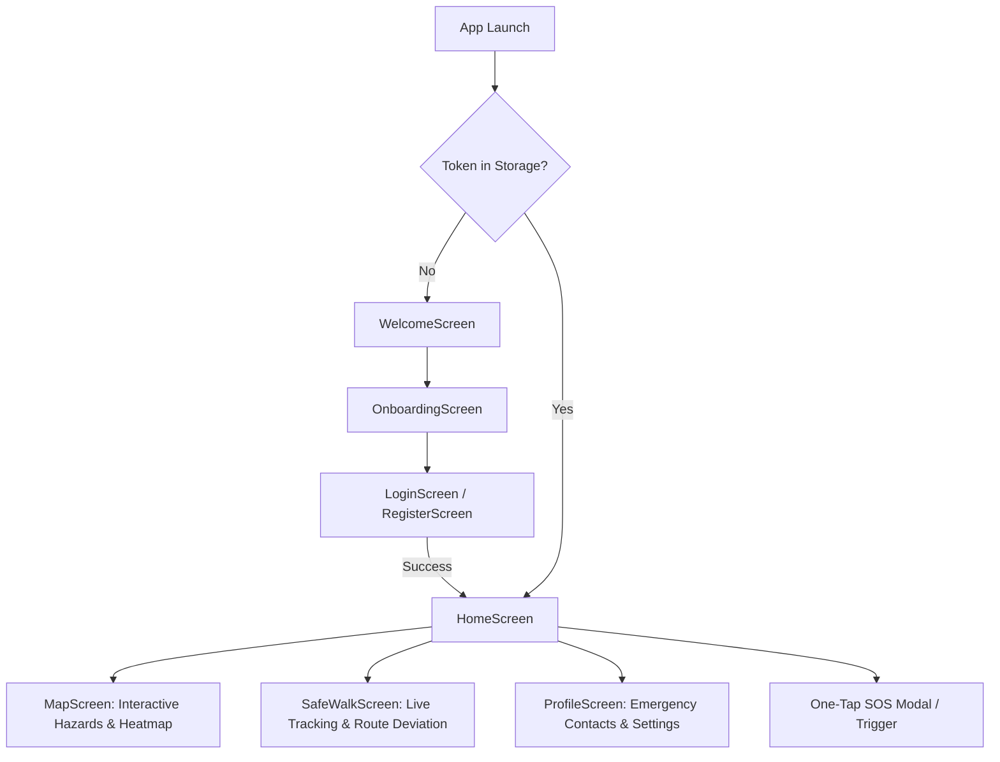

# SAFORA — Mobile Application Guide

This guide covers the mobile client architecture, screen flows, state management, monorepo configuration, and Android build steps.

## 1. Overview & Technologies

- **Framework**: React Native `0.87.1` (with Fabric / New Architecture enabled)
- **Language**: TypeScript `5.x`
- **JS Engine**: **Hermes** with bytecode precompilation (`hermesc`)
- **Navigation**: `@react-navigation/native-stack`
- **State Management**: **Zustand** + `@react-native-async-storage/async-storage`
- **Spatial Visualization**: Native **Safety Radar & Open Geospatial Canvas Engine** (backed by PostGIS `geography(Point, 4326)` instead of proprietary Google Maps API)
- **Icons**: `react-native-vector-icons` (Ionicons / MaterialCommunityIcons)

---

## 2. Screen & Navigation Flow

The mobile application utilizes a native stack navigator with automatic authentication-aware routing:



### Screen Directory Structure (`apps/mobile/src/screens/`)
- **`WelcomeScreen.tsx`**: High-impact brand introduction with safety highlights.
- **`OnboardingScreen.tsx`**: Visual walk-through of Hazard Reporting, Safe Walk, and Instant SOS.
- **`LoginScreen.tsx` / `RegisterScreen.tsx`**: Authenticates users against the Express backend and saves JWT to storage.
- **`HomeScreen.tsx`**: Dashboard displaying live safety status, quick-action buttons, recent local alerts, and active Safe Walk cards.
- **`MapScreen.tsx`**: Full-screen map rendering nearby hazards, filtering categories (lighting, road hazards, waterlogging), and displaying safety clusters.
- **`SafeWalkScreen.tsx`**: Journey configuration (destination picker, contacts selection), active route view, and emergency escalation timers.
- **`ProfileScreen.tsx`**: User profile, trusted emergency contacts CRUD, and notification preferences.

---

## 3. Monorepo Metro Configuration

Because SAFORA is organized as an npm workspace, packages such as `react-native-safe-area-context` and `react-native-screens` are hoisted to the root `node_modules`.

To prevent **duplicate instances of `react-native`** in the Metro bundle (which triggers the error `Invariant Violation: View config getter callback for component 'RNCSafeAreaProvider' must be a function`), `apps/mobile/metro.config.js` is configured with:

1. `disableHierarchicalLookup: true` — tells Metro to only look in explicit paths rather than ascending through parent folders.
2. `nodeModulesPaths` — explicitly checks `apps/mobile/node_modules` first, then the root `node_modules`.
3. `extraNodeModules` — guarantees that imports of `react-native` and `react` always resolve to singletons.

```javascript
// apps/mobile/metro.config.js
const { getDefaultConfig, mergeConfig } = require('@react-native/metro-config');
const path = require('path');

const projectRoot = __dirname;
const monorepoRoot = path.resolve(projectRoot, '../..');

const config = {
  watchFolders: [monorepoRoot],
  resolver: {
    disableHierarchicalLookup: true,
    nodeModulesPaths: [
      path.resolve(projectRoot, 'node_modules'),
      path.resolve(monorepoRoot, 'node_modules'),
    ],
    extraNodeModules: {
      'react-native': path.resolve(projectRoot, 'node_modules/react-native'),
      'react': path.resolve(monorepoRoot, 'node_modules/react'),
    },
  },
};

module.exports = mergeConfig(getDefaultConfig(__dirname), config);
```

---

## 4. Building the Android APK

### 4.1 APK Size Optimization
By default, React Native packages 4 native architectures (arm64-v8a, armeabi-v7a, x86, x86_64), resulting in a massive ~170MB debug APK.

In `apps/mobile/android/gradle.properties`:
```properties
# Limits packaging to arm64-v8a (modern physical phones)
reactNativeArchitectures=arm64-v8a
```
This reduces the compiled APK size down to **~59 MB**.

### 4.2 Standalone Bundle Configuration
To enable the debug APK to run standalone on a phone without having to run a live Metro bundler on your PC:
In `apps/mobile/android/app/build.gradle`:
```groovy
react {
    // Empty list packages JS bundle inside the APK
    debuggableVariants = []
}
```

### 4.3 Build Commands

From the workspace root or inside `apps/mobile/android`:

```powershell
# Navigate to android folder
cd D:\Safora\apps\mobile\android

# Clean previous build artifacts
.\gradlew clean

# Build the debug APK
.\gradlew assembleDebug
```

The compiled APK will be output at:
```
apps/mobile/android/app/build/outputs/apk/debug/app-debug.apk
```

### 4.4 Installing to a Device via ADB
```powershell
adb install -r apps/mobile/android/app/build/outputs/apk/debug/app-debug.apk
```

---

## 5. Permissions Checklist

| Permission | Android Manifest Key | Purpose |
|---|---|---|
| Fine Location | `ACCESS_FINE_LOCATION` | Accurate hazard placement and GPS route tracking |
| Background Location | `ACCESS_BACKGROUND_LOCATION` | Safe Walk tracking when the phone screen is turned off |
| Internet | `INTERNET` | API requests & real-time Socket.IO streams |
| Notifications | `POST_NOTIFICATIONS` | Arrival alerts, deviation warnings, emergency SOS |
