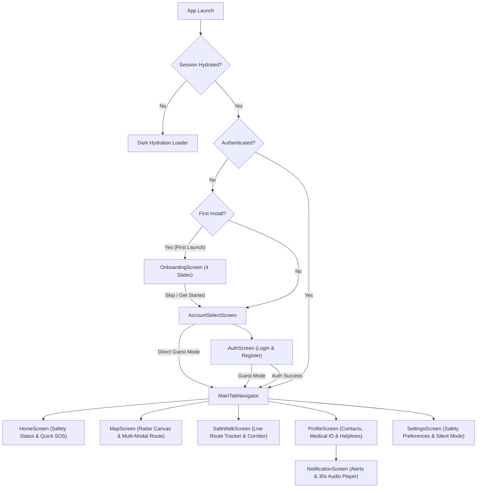

# SAFORA — Mobile Application Guide

This guide covers the mobile client architecture, screen flows, state management, monorepo configuration, and Android build steps.

## 1. Overview & Technologies

- **Framework**: React Native `0.87.1` (with Fabric / New Architecture enabled)
- **Language**: TypeScript `5.x`
- **JS Engine**: **Hermes** with bytecode precompilation (`hermesc`)
- **Navigation**: `@react-navigation/native-stack`
- **State Management**: **Zustand** + `@react-native-async-storage/async-storage`
- **Spatial Visualization**: Native **Safety Radar & Open Geospatial Canvas Engine** (backed by PostGIS `geography(Point, 4326)` instead of proprietary Google Maps API)
- **Icons**: `react-native-vector-icons` (Ionicons / MaterialCommunityIcons)

---

## 2. Screen & Navigation Flow

The mobile application utilizes a native stack navigator with automatic authentication-aware routing and session rehydration:



### Screen Directory Structure (`apps/mobile/src/screens/`)
- **`OnboardingScreen.tsx`**: 4-step interactive carousel highlighting Safety Heatmap, Safe Walk, Instant SOS, and Community Alerts with "Skip" and "Get Started" buttons.
- **`AccountSelectScreen.tsx`**: Clean portal presenting Student / Campus Walker sign-in, account creation, or Examiner Guest Mode.
- **`AuthScreen.tsx`**: Segmented tab switcher between Login and Register with live form validation, eye password toggles, and direct routing to `MainTabs`.
- **`HomeScreen.tsx`**: Main safety dashboard with live score indicator, quick-trigger SOS (with 5-second cancel window), recent verified hazards feed, and active Safe Walk status card.
- **`MapScreen.tsx`**: Full-screen interactive radar canvas with category filtering, PostGIS hazard clusters, multi-modal routing (Car, 2-Wheeler, Walk), local place search, and map layer controls.
- **`SafeWalkScreen.tsx`**: Real-time walking journey engine with dual GPS tracking, continuous path rendering, calibrated walk times, 150m corridor monitoring, and deviation grace timers.
- **`ProfileScreen.tsx`**: Emergency contacts management (with email verification, Safora member detection, Test SOS Drills), Blood Group, medical notes, header Settings `⚙️`, and Notification Bell `🔔` with unread counter badge.
- **`NotificationScreen.tsx`**: Dedicated Safety Alerts Center displaying incoming family emergency alerts and test drills, live GPS pin links, battery percentages, and an embedded **30-second live audio evidence player** with animated waveforms.
- **`SettingsScreen.tsx`**: Granular safety preferences (silent vs siren SOS, corridor buffer, emergency hotlines).

---

## 3. Navigation Stack & Android Hardware Back Handling
To provide native Android UX and prevent abrupt app closure:
- **Hierarchical Step-Back Handling**:
  1. **Overlays First**: In `MapScreen` and `SafeWalkScreen`, pressing the Android hardware/gesture back button first closes any open place search dropdowns, selected hazard cards, or route previews.
  2. **Tab History Stack**: In `MainTabNavigator`, a `tabHistory` stack tracks visited tabs. Pressing Back pops the history (e.g., `Profile` $\rightarrow$ `Map` $\rightarrow$ `Home`) one step at a time instead of exiting.
  3. **Exit Protection**: On the `Home` tab, pressing back triggers an Android Toast (`"Press back again to exit Safora"`), requiring a double-tap within 2 seconds to close the app.

---

## 4. Core Geospatial & Routing Architecture

### 4.1 Open Geospatial Canvas Engine (`OpenMapView.tsx`)
Rather than relying on proprietary Google Maps SDKs that require active billing accounts and can crash without API keys, SAFORA features an open-source, resilient geospatial canvas powered by Leaflet inside a hardware-accelerated `WebView`:
- **100% Watermark-Free & Keyless Tactical Basemap Switcher**:
  - ⚡ **Dark Matrix (Default)**: High-tech cyber dark theme via OpenStreetMap tiles processed with hardware-accelerated CSS matrix inversion filter (`.dark-matrix-tiles`), exactly matching the Web Admin Command Center.
  - 🛡️ **Tactical Gray**: High-contrast, dark slate cartography via **Esri World Dark Gray Base** (`https://server.arcgisonline.com/ArcGIS/rest/services/Canvas/World_Dark_Gray_Base/MapServer/tile/{z}/{y}/{x}`) with `maxNativeZoom: 16, maxZoom: 19`.
  - 🛰️ **Satellite View**: Ultra-high-resolution satellite imagery via **Esri World Imagery** (`https://server.arcgisonline.com/ArcGIS/rest/services/World_Imagery/MapServer/tile/{z}/{y}/{x}`).
  - 🛣️ **Street Map / Light Mode**: Crisp street geometry via **OpenStreetMap** (`https://tile.openstreetmap.org/{z}/{x}/{y}.png`).
- **Infinite World Duplication & Bounds Locking**:
  - Configured with `noWrap: true` on `L.tileLayer` to stop horizontal tile repeating beyond the -180° to +180° meridians.
  - Constrained with `maxBounds: [[-85, -180], [85, 180]]`, `maxBoundsViscosity: 1.0`, `minZoom: 3`, and `worldCopyJump: false` to lock camera view strictly to legitimate global bounds.
- **10km Offline Map Caching**:
  - The map injects `window.cacheSurrounding10km(lat, lon, radiusKm)` upon coordinate load.
  - Automatically fetches and stores the 10km bounding box matrix of tiles into the device's HTML5 `CacheStorage`.
  - When the phone enters offline or no-signal zones, cached map tiles load instantly from internal storage.
- **Keyless & Quota-Independent Tile Architecture**:
  - Map tile rendering requires zero MapTiler or third-party API keys, preventing quota exhaustion, billing freezes, or watermark pollution. MapTiler API keys in the project are reserved strictly for optional geocoding fallback and diagnostics telemetry.

### 4.2 Calibrated Multi-Modal Routing Engine (`routingService.ts`)
Standard routing services often fail to represent real-world pedestrian speeds. SAFORA implements calibrated travel-time mathematics:
- **Walking Pace**: Calibrated to $1.60\text{ m/s}$ ($5.8\text{ km/h}$), accurately yielding **~10.4 minutes per 1 km**.
- **2-Wheeler (Bike/Scooter)**: Calibrated to $8.88\text{ m/s}$ ($32\text{ km/h}$) $+ 20\text{s}$ agile traffic buffer $\rightarrow$ **~2.2 minutes per 1 km**.
- **Car**: Calibrated to $7.22\text{ m/s}$ ($26\text{ km/h}$) $+ 45\text{s}$ signal/parking buffer $\rightarrow$ **~3.0 minutes per 1 km**.
- **Routing Geometry**: Queries OSRM (`router.project-osrm.org`) for actual road networks, falling back to a $1.25\times$ road curvature factor over Haversine calculations when offline.
- **Local Search Engine**: Employs Photon OpenStreetMap geocoding with user GPS latitude/longitude biasing, falling back to MapTiler geocoding.

### 3.3 Dual-Strategy Geolocation (`locationService.ts`)
- **Primary Strategy**: High-accuracy GPS (`enableHighAccuracy: true`, timeout: 6,000ms).
- **Secondary Fallback**: Wi-Fi/Cellular network triangulation (`enableHighAccuracy: false`, timeout: 10,000ms).
- **Continuous Tracking**: `watchUserLocation(onUpdate, onError)` streams live coordinate updates with a 3-meter displacement filter, ensuring buttery-smooth position tracking during Safe Walk.

---

## 3. Monorepo Metro Configuration

Because SAFORA is organized as an npm workspace, packages such as `react-native-safe-area-context` and `react-native-screens` are hoisted to the root `node_modules`.

To prevent **duplicate instances of `react-native`** in the Metro bundle (which triggers the error `Invariant Violation: View config getter callback for component 'RNCSafeAreaProvider' must be a function`), `apps/mobile/metro.config.js` is configured with:

1. `disableHierarchicalLookup: true` — tells Metro to only look in explicit paths rather than ascending through parent folders.
2. `nodeModulesPaths` — explicitly checks `apps/mobile/node_modules` first, then the root `node_modules`.
3. `extraNodeModules` — guarantees that imports of `react-native` and `react` always resolve to singletons.

```javascript
// apps/mobile/metro.config.js
const { getDefaultConfig, mergeConfig } = require('@react-native/metro-config');
const path = require('path');

const projectRoot = __dirname;
const monorepoRoot = path.resolve(projectRoot, '../..');

const config = {
  watchFolders: [monorepoRoot],
  resolver: {
    disableHierarchicalLookup: true,
    nodeModulesPaths: [
      path.resolve(projectRoot, 'node_modules'),
      path.resolve(monorepoRoot, 'node_modules'),
    ],
    extraNodeModules: {
      'react-native': path.resolve(projectRoot, 'node_modules/react-native'),
      'react': path.resolve(monorepoRoot, 'node_modules/react'),
    },
  },
};

module.exports = mergeConfig(getDefaultConfig(__dirname), config);
```

---

## 4. Building the Android APK

### 4.1 APK Size Optimization
By default, React Native packages 4 native architectures (arm64-v8a, armeabi-v7a, x86, x86_64), resulting in a massive ~170MB debug APK.

In `apps/mobile/android/gradle.properties`:
```properties
# Limits packaging to arm64-v8a (modern physical phones)
reactNativeArchitectures=arm64-v8a
```
This reduces the compiled APK size down to **~59 MB**.

### 4.2 Standalone Bundle Configuration
To enable the debug APK to run standalone on a phone without having to run a live Metro bundler on your PC:
In `apps/mobile/android/app/build.gradle`:
```groovy
react {
    // Empty list packages JS bundle inside the APK
    debuggableVariants = []
}
```

### 4.3 Build Commands

From the workspace root or inside `apps/mobile/android`:

```powershell
# Navigate to android folder
cd D:\Safora\apps\mobile\android

# Clean previous build artifacts
.\gradlew clean

# Build standalone Release APK (Production APK for physical devices)
.\gradlew assembleRelease

# Build Debug APK (for development testing)
.\gradlew assembleDebug
```

The compiled release APK will be output at:
```
apps/mobile/android/app/build/outputs/apk/release/app-release.apk
```

### 4.4 Installing to a Device via ADB
```powershell
adb install -r apps/mobile/android/app/build/outputs/apk/release/app-release.apk
```

---

## 5. Direct USB Running on Physical Phone (Developer Options)

To directly deploy, run, and live-debug SAFORA on your physical Android smartphone over USB:

### 5.1 Enable Developer Options & USB Debugging
1. Open phone **Settings** → **About Phone**.
2. Tap **Build Number** 7 times until you see *"You are now a developer!"*.
3. Navigate to **System** (or **Additional Settings**) → **Developer Options**.
4. Enable:
   - ✅ **USB Debugging**
   - ✅ **Install via USB** *(vital on Xiaomi/Redmi/MIUI, Realme, and Oppo devices)*.

### 5.2 Connect via USB & Authorize
1. Connect the phone to the workstation via a USB data cable and select **File Transfer (MTP)** mode.
2. Accept the on-screen prompt: *"Allow USB debugging from this computer?"* (check *Always allow*).
3. Verify device connection in terminal:
   ```bash
   adb devices
   ```

### 5.3 Reverse Ports for Local Backend & Metro
Since the backend API (`:5000`) and Metro bundler (`:8081`) run on your host PC, bridge ports over USB so the phone accesses them directly at `http://localhost:5000`:
```bash
adb reverse tcp:8081 tcp:8081
adb reverse tcp:5000 tcp:5000
```

### 5.4 Launch App onto Phone
From `apps/mobile`:
```powershell
# Terminal 1: Start Metro bundler
npm start

# Terminal 2: Build & install debug APK directly onto phone
npm run android
```

---

## 6. Permissions Checklist

| Permission | Android Manifest Key | Purpose |
|---|---|---|
| Fine Location | `ACCESS_FINE_LOCATION` | Accurate hazard placement and GPS route tracking |
| Background Location | `ACCESS_BACKGROUND_LOCATION` | Safe Walk tracking when the phone screen is turned off |
| Internet | `INTERNET` | API requests & real-time Socket.IO streams |
| Notifications | `POST_NOTIFICATIONS` | Arrival alerts, deviation warnings, emergency SOS |
