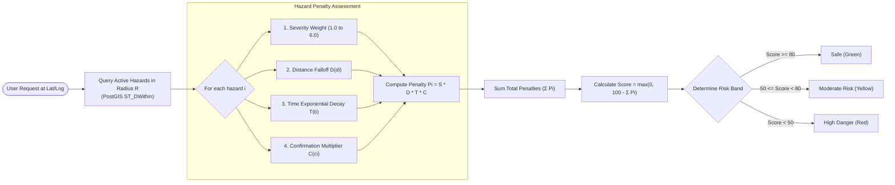
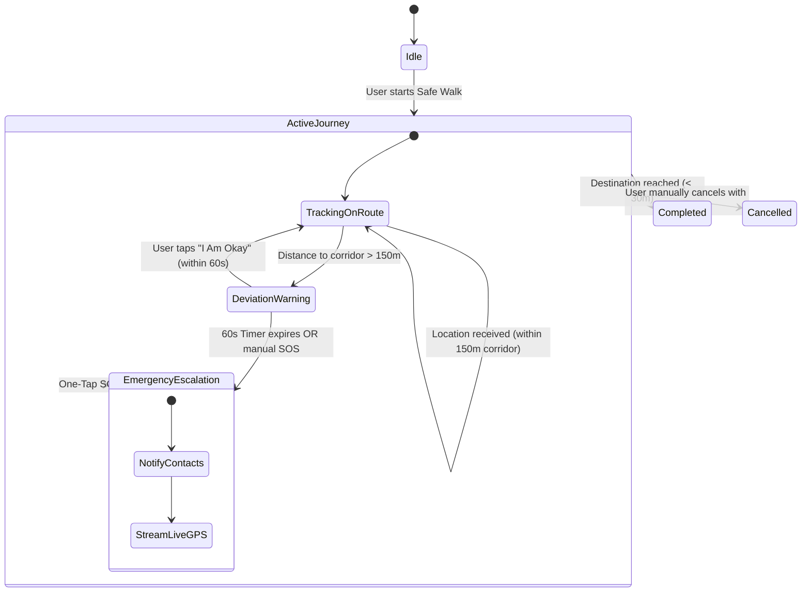

# SAFORA — Safety Algorithms & Core Logic

This document details the mathematical models, spatial algorithms, and state machines governing SAFORA's safety score calculation, hazard clustering, and Safe Walk deviation escalation.

---

## 1. Safety Score Algorithm

The Safety Score represents the relative safety of any given coordinate $(lat, lng)$ on a normalized scale from **0 to 100** (where 100 is completely safe and 0 indicates high danger).

### 1.1 Hazard Penalty Formulation
For each active hazard report $i$ within a search radius $R$ (e.g., 1,000 meters) of the target coordinate, a penalty $P_i$ is calculated:

$$P_i = S_i \times D(d_i) \times T(t_i) \times C_i$$

Where:
1. **Severity Weight ($S_i \in [1, 5]$)**:
   - Severity 1 (Minor inconvenience, e.g. small puddle): Weight = $1.0$
   - Severity 2 (Caution advised): Weight = $1.5$
   - Severity 3 (Moderate hazard, e.g. broken streetlight): Weight = $2.5$
   - Severity 4 (Severe hazard, e.g. isolated area, harassment): Weight = $4.0$
   - Severity 5 (Extreme emergency, e.g. open trench, violent incident): Weight = $6.0$

2. **Distance Falloff Function ($D(d_i)$)**:
   Linear or Gaussian decay over distance $d_i$ (meters) from the query coordinate:
   $$D(d_i) = \max\left(0, 1 - \frac{d_i}{R}\right)$$
   A hazard 50m away impacts the score significantly more than a hazard 900m away.

3. **Recency Exponential Decay ($T(t_i)$)**:
   Older reports must decay in influence so that temporary hazards (e.g. waterlogging that dried up) do not permanently degrade an area's score:
   $$T(t_i) = e^{-\lambda \cdot \Delta t}$$
   Where $\Delta t$ is the age of the report in hours, and $\lambda = \frac{\ln(2)}{t_{\text{half}}}$ with a half-life $t_{\text{half}} = 24 \text{ hours}$.

4. **Community Confirmation Multiplier ($C_i$)**:
   Reports confirmed by multiple distinct users carry greater confidence:
   $$C_i = 1.0 + 0.15 \times \min(\text{confirmations}_i, 5)$$

### 1.2 Total Score Normalization
The total penalty is summed and subtracted from the base score:
$$\text{SafetyScore} = \max\left(0, 100 - \sum_{i=1}^{N} P_i\right)$$

### 1.3 Safety Score Computation Pipeline



---

## 2. Spatial Clustering & Deduplication

To prevent duplicate reports of the same incident (e.g. 5 students reporting the exact same broken streetlamp) from skewing the map:

- **Algorithm**: Density-Based Spatial Clustering of Applications with Noise (**DBSCAN**) via PostGIS `ST_ClusterDBSCAN`.
- **Clustering Threshold ($\epsilon$)**: **50 meters** ($\approx 0.00045^\circ$).
- **Rule**: Hazards of the same category within 50 meters are visually merged into a single cluster marker on the client map, displaying the consolidated count and max severity.

```sql
-- DBSCAN 50m cluster query
SELECT 
    cid,
    category,
    COUNT(*) as total_reports,
    AVG(latitude) as cluster_latitude,
    AVG(longitude) as cluster_longitude,
    MAX(severity) as peak_severity
FROM (
    SELECT 
        id, category, severity, latitude, longitude,
        ST_ClusterDBSCAN(location::geometry, eps := 0.00045, minpoints := 1) OVER (PARTITION BY category) AS cid
    FROM reports
    WHERE status = 'active'
) grouped
GROUP BY cid, category;
```

---

## 3. Safe Walk Deviation State Machine

Safe Walk mode tracks the user along a defined route corridor and incorporates a multi-stage safety verification system to minimize false alarms while ensuring rapid emergency escalation.



### 3.1 Deviation Parameters
- **Corridor Radius**: $150 \text{ meters}$ buffer around the planned polyline.
- **Grace Window**: $60 \text{ seconds}$ countdown prompt displayed with vibration and audible chime asking the walker: *"Are you okay? Route deviation detected."*
- **Auto-Escalation**: If no user response is recorded within 60 seconds, or if the phone's battery reaches critical (<5%) while deviated, an automated high-priority push notification and SMS is broadcast to all assigned trusted contacts.

---

## 4. Anti-Abuse & Moderation

1. **Submission Rate Limiting**: Max 5 hazard reports per user per hour.
2. **Text Sanitization & Name Filter**: Free-text descriptions are automatically scanned against a blocklist of personal identifiers to prevent harassment, defamation, or false accusations against individuals.
3. **Admin Moderation Flagging**: Reports flagged by multiple users are temporarily hidden from the global heatmap until an administrator verifies them in the Admin Dashboard.
