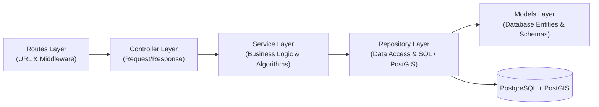

# SAFORA — Engineering Standards & Architectural Conventions

This document defines the formal architectural standards, directory conventions, design patterns, and coding guidelines for the SAFORA platform across Mobile, Backend, Database, and Monorepo layers.

---

## 1. Monorepo & Codebase Organization

### 1.1 Monorepo Structure & Package Boundaries
SAFORA operates as an npm/pnpm workspace monorepo.

```
safora/
├── apps/
│   ├── backend/                # Node.js + Express.js API Server
│   └── mobile/                 # React Native Mobile Client
├── packages/
│   └── shared-types/           # Shared TypeScript domain models & DTOs
└── docs/                       # Specifications, DFDs, blueprints
```

### 1.2 Package Scoping & Imports
- **Shared Code Rule**: Any interface, enum, or type used by both mobile and backend must reside in `packages/shared-types`.
- **Import Standard**: Use workspace imports rather than relative file traversal:
  ```typescript
  // Preferred
  import { User, HazardReport } from '@safora/shared-types';
  // Avoid
  import { User } from '../../../packages/shared-types/src';
  ```

### 1.3 Modularity & File Size Limit Standard
To prevent code rot, cognitive overload, and merge conflicts, SAFORA enforces strict file size boundaries:
- **Maximum File Limit**: No source file should ever reach 1,000–2,000 lines. The target maximum threshold is **300 to 500 lines**.
- **Backend Layers**:
  - Routes: $< 50$ lines (strictly path declaration and middleware binding).
  - Controllers: $< 150$ lines (strictly request parsing and service delegation).
  - Services: $< 300$ lines (domain logic, spatial queries, calculations).
  - Configuration: $< 200$ lines.
- **Mobile UI & Screens**:
  - If a screen grows beyond $400$ lines, extract presentational cards, modal dialogs, and radar components into dedicated subcomponents under `components/` or feature folders.
  - Extract sensor and device listeners into custom hooks under `hooks/`.

---

## 2. Mobile Architecture Standards (React Native 0.87+)

### 2.1 Feature-Based Folder Structure
For scalability, organize code by **business feature** rather than technical layer:

```text
apps/mobile/src/
├── app/                  # App initialization, Providers, RootNavigator
├── assets/               # Fonts, static illustrations, icons
├── components/           # Generic, reusable UI atoms (Button, Card, Input)
├── features/             # Domain-specific modules
│   ├── auth/             # Login, Register, Session store, Auth hooks
│   │   ├── components/
│   │   ├── hooks/
│   │   ├── screens/
│   │   └── types.ts
│   ├── hazards/          # Hazard reporting, Pin creation, Category picker
│   ├── radar/            # Safety Radar canvas, coordinate plotting
│   ├── safe-walk/        # Safe Walk tracking, deviation prompt, corridor logic
│   ├── sos/              # One-Tap SOS modal, trigger animation, dispatch
│   └── profile/          # User profile, trusted contacts CRUD
├── services/             # Axios API client, native device location engine
├── store/                # Global Zustand stores (AuthStore, SessionStore)
└── theme/                # Color palette, spacing tokens, typography
```

### 2.2 Component & Hook Separation (Presentational vs. Container)
- **Dumb UI Components**: UI components should receive data and callbacks strictly via props.
- **Custom Hooks**: Extract state, side-effects, and sensor subscriptions into specialized hooks:
  ```typescript
  // Custom Hook encapsulates location streaming and corridor math
  export function useSafeWalkTracker(journeyId: string) {
    const [status, setStatus] = useState<'on_route' | 'deviated'>('on_route');
    // ...
    return { status, currentLocation, confirmSafe };
  }
  ```

### 2.3 Zustand State Management Standard
- Keep stores lightweight, domain-scoped, and use **selectors** to prevent unneeded component re-renders:
  ```typescript
  // Preferred (subscribed only to user changes)
  const user = useAuthStore(state => state.user);
  
  // Avoid (re-renders on any store update)
  const { user, token, setToken } = useAuthStore();
  ```

### 2.4 New Architecture (Fabric & TurboModules) Rules
- Ensure third-party dependencies explicitly support React Native's New Architecture.
- Avoid legacy synchronous bridge calls.
- In `metro.config.js`, maintain `disableHierarchicalLookup: true` with explicit `extraNodeModules` to prevent duplicate runtime singletons across hoisted monorepo packages.

---

## 3. Backend Architecture Standards (Node.js + Express + TypeScript)

### 3.1 Controller-Service-Repository-Model Pattern (4-Tier MVC Architecture)
To eliminate "fat controllers" and isolate SQL queries, SAFORA follows a strict 4-tier layered separation:



1. **Routes (`src/routes/`)**: Declares endpoint paths, binds auth middleware, and applies Zod validation schemas.
2. **Controllers (`src/controllers/`)**: Thin layer responsible **only** for extracting request params/body, invoking the service, and returning HTTP responses.
3. **Services (`src/services/`)**: Pure business logic (e.g. exponential decay safety score math, DBSCAN clustering, Safe Walk corridor threshold checks, SOS notification orchestration). Contains zero raw SQL.
4. **Repositories (`src/repositories/`)**: The Data Access Layer (DAO). Contains all SQL statements, PostGIS spatial queries (`ST_DWithin`, `ST_Distance`, `ST_MakePoint`), and table mutations.
5. **Models (`src/models/`)**: Database entity representations, table column mappers, and row interfaces. Shared contracts for API payloads remain in `@safora/shared-types`.

### 3.2 Request Validation at the Edge
Validate all incoming payloads before they reach business logic using schema validators (e.g. `zod`):
```typescript
import { z } from 'zod';

export const createReportSchema = z.object({
  category: z.enum(['lighting', 'road_hazard', 'waterlogging', 'isolated_area', 'traffic', 'other']),
  title: z.string().min(3).max(100),
  severity: z.number().int().min(1).max(5),
  latitude: z.number().min(-90).max(90),
  longitude: z.number().min(-180).max(180),
});
```

### 3.3 Centralized Error Handling
Do not scatter `try/catch` with ad-hoc responses. Use an application error hierarchy:
```typescript
export class AppError extends Error {
  constructor(
    public message: string,
    public statusCode: number = 500,
    public details?: unknown
  ) {
    super(message);
  }
}

// Global error middleware (registered last in app.ts)
app.use((err: Error, req: Request, res: Response, next: NextFunction) => {
  const status = err instanceof AppError ? err.statusCode : 500;
  res.status(status).json({
    error: err.message || 'Internal Server Error',
    timestamp: new Date().toISOString(),
  });
});
```

### 3.4 Separation of `app.ts` from `server.ts`
- **`app.ts`**: Configures Express, middleware, and route mounting (exported for supertest integration testing).
- **`server.ts`**: Starts `http.createServer()`, binds Socket.IO, listens on `PORT`, and handles SIGTERM/SIGINT graceful shutdowns.

---

## 4. PostgreSQL & PostGIS Spatial Standards

### 4.1 Schema Naming Conventions
- **Tables**: Lowercase, plural nouns in `snake_case` (`users`, `reports`, `journeys`, `sos_alerts`).
- **Columns**: Lowercase `snake_case` (`user_id`, `created_at`, `confirmations_count`).
- **Foreign Keys**: Target singular name + `_id` (`user_id` references `users(id)`).

### 4.2 Spatial Data Types
- **Standard**: Always use `geography(Point, 4326)` for GPS coordinate storage.
- **Rationale**: `geography` performs ellipsoidal spherical calculations natively in meters, avoiding planar UTM reprojections.
- **Index Standard**: Always create a GiST index on all spatial columns:
  ```sql
  CREATE INDEX idx_reports_location ON reports USING GIST (location);
  ```

### 4.3 Spatial Query Idioms
1. **Radius / Proximity**:
   - Always use `ST_DWithin(location, ST_MakePoint(lng, lat)::geography, radius_in_meters)` because it utilizes the spatial GiST index.
   - Avoid `WHERE ST_Distance(...) < radius` as the primary filter because it forces a sequential scan.
2. **Clustering**:
   - Use `ST_ClusterDBSCAN(location::geometry, eps, minpoints) OVER ()` with an epsilon of approximately $0.00045^\circ$ ($\approx 50 \text{ meters}$).
3. **Corridor Buffering**:
   - Buffer walking paths using `ST_DWithin(point, route_linestring, corridor_buffer_meters)`.

---

## 5. Real-Time Socket.IO Standards

### 5.1 Event Naming Standard
Adopt a strict `noun:verb` or `domain:action` pattern:
- **Client to Server**:
  - `journey:start`
  - `journey:update-location`
  - `journey:confirm-safe`
  - `sos:trigger`
- **Server to Client**:
  - `journey:deviation-warning`
  - `journey:ended`
  - `hazard:broadcast`
  - `sos:alert-dispatched`

### 5.2 Room Isolation
Never broadcast private location streams globally. Always scope to room IDs:
```typescript
// On joining a safe walk session
socket.join(`journey:${journeyId}`);

// Emitting coordinates only to trusted contacts watching this journey
io.to(`journey:${journeyId}`).emit('journey:location-update', coords);
```

---

## 6. Push Notifications (Firebase Cloud Messaging)

### 6.1 Android Notification Channel Standards

| Channel ID | Name | Importance | Sound / Vibration | Use Case |
|---|---|---|---|---|
| `emergency_sos` | Emergency SOS | `HIGH` / `MAX` | Loud alarm, continuous vibration, bypasses DND | One-Tap SOS alerts |
| `safe_walk_alerts` | Safe Walk Warnings | `HIGH` | Distinct alert chime | Route deviation 60s prompt, timeout |
| `hazard_updates` | Community Hazards | `DEFAULT` | Standard notification | New verified hazards nearby |

### 6.2 FCM Payload Formatting
- **Data Payloads**: Use data-only payloads (`data: { type: 'SOS_ALERT', ... }`) when the mobile client needs to run background logic before rendering the notification.
- **Notification Payloads**: Use notification payloads for direct OS notification tray display when the app is killed.

---

## 7. Security & Privacy Standards

1. **Password Hashing**: Use `bcryptjs` with a work factor of $\ge 10$ rounds.
2. **SQL Injection Prevention**: All queries to PostgreSQL must use parameterized variables (`$1`, `$2`, ...); never concatenate user input into SQL strings.
3. **Ephemeral Location Retention**: Safe Walk location history points are transient; they are automatically marked inactive or pruned once a journey concludes.
4. **CORS Configuration**: Restrict allowed origins to mobile application schemes and approved administration domains in production.
5. **Rate Limiting**: Apply IP and user-based limits to prevent spam on `/api/reports` and `/api/auth` endpoints.
