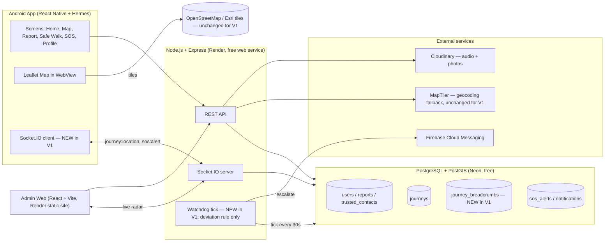
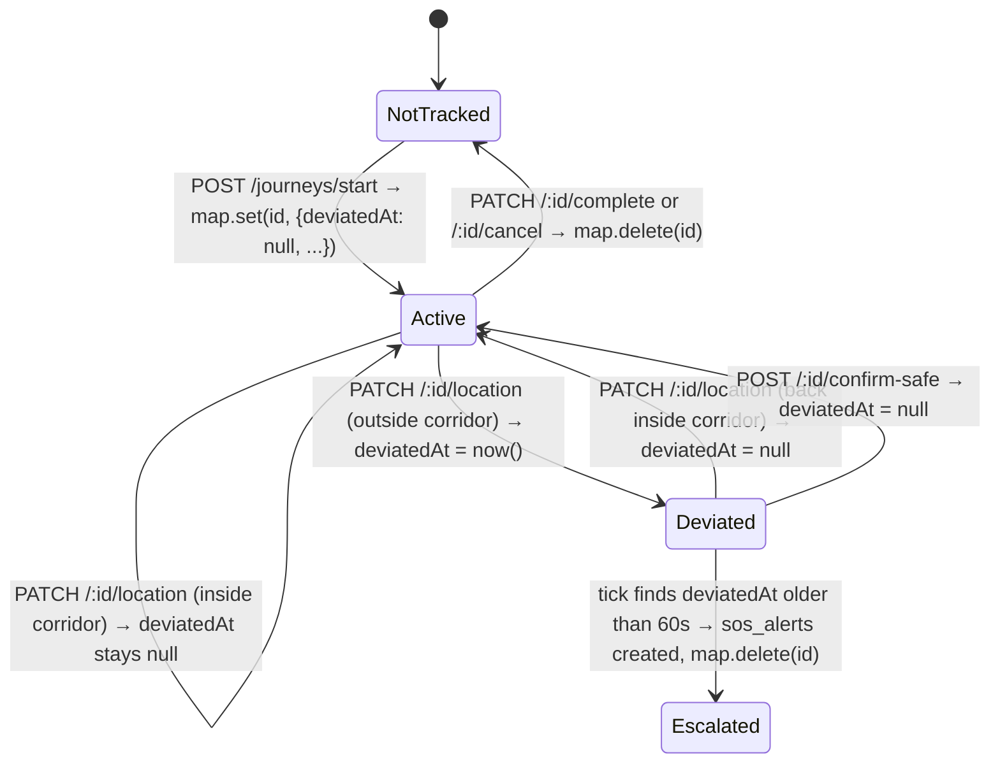
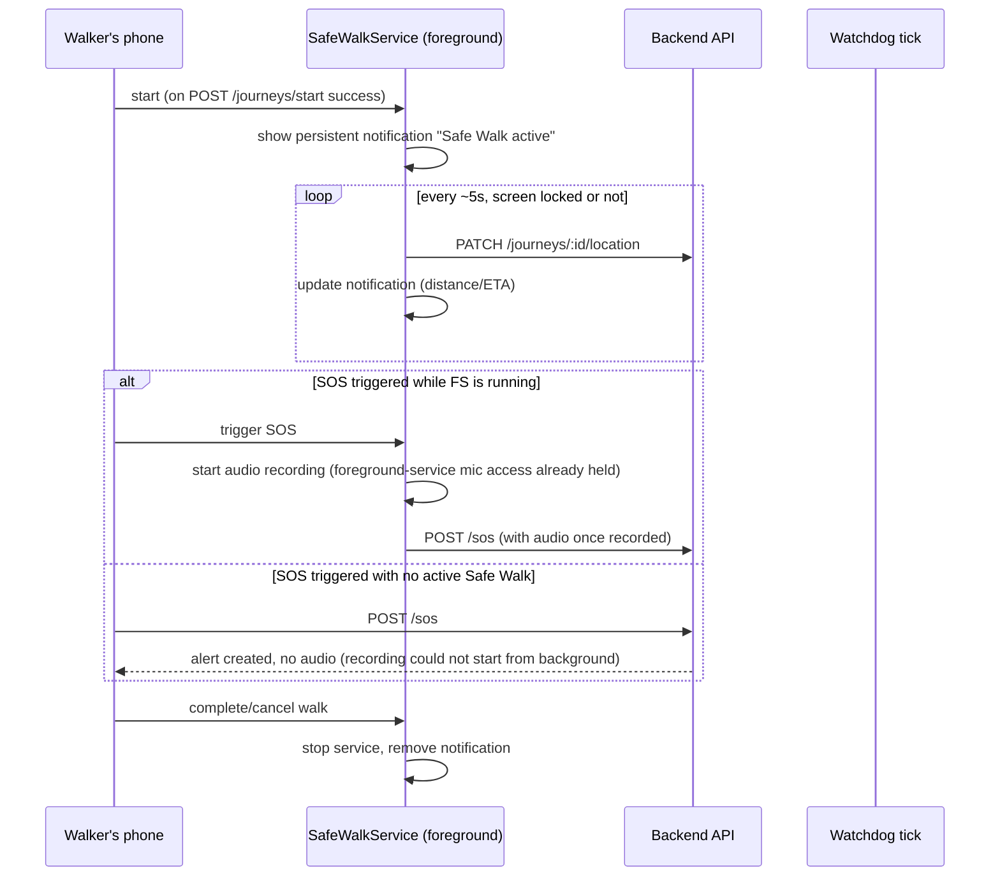

# Architecture — V1

## 1. System diagram



## 2. What's existing vs new in V1

| Layer | Existing (unchanged) | New in V1 |
|---|---|---|
| Mobile | Screens, offline hazard queue, map, route preview, SOS countdown, decoy/fake-call | Socket.IO client, photo picker, heatmap layer, honest loading/error state on the Home safety-score card |
| Backend | Auth, hazard CRUD, SOS trigger, corridor-check math in `journeyService` | Breadcrumb persistence, `journey:location` socket emission actually consumed, watchdog tick (deviation rule only), `confirm-safe` endpoint, public-report DTO stripped of identity |
| Database | `users`, `reports`, `trusted_contacts`, `journeys`, `sos_alerts`, `notifications` | `journey_breadcrumbs`; `journeys.deviated_at`, `journeys.escalated_at`; `users.age`, `users.age_notice_ack`, `users.terms_accepted_at` |
| Admin | Dashboard, SOS queue, hazard moderation | Real (not sample) Safe Walk radar; sample-data fallback removed |
| Maps/geocoding | Leaflet + OSM/Esri tiles, Photon/MapTiler search | **Unchanged** — the OpenFreeMap migration and search tuning are V2 |
| Routing | OSRM demo server, single geometry for all modes | **Unchanged** — real per-mode routing is V2 |

## 3. Request/data flow: Safe Walk with live tracking and deviation alert (the core new V1 flow)

```mermaid
sequenceDiagram
    participant W as Walker's phone
    participant API as Backend API
    participant SIO as Socket.IO
    participant DB as Postgres
    participant WD as Watchdog tick
    participant G as Guardian's phone
    participant FCM as Firebase (push)

    W->>API: POST /api/journeys/start
    API->>DB: INSERT journeys
    W->>SIO: connect (JWT), join journey:{id}
    G->>SIO: connect (JWT), join journey:{id} (if invited/guardian)
    loop every ~5s while walking
        W->>API: PATCH /api/journeys/:id/location
        API->>DB: INSERT journey_breadcrumbs; UPDATE journeys.last_location
        API->>API: corridor check (existing segment-distance math)
        API-->>SIO: emit journey:location
        SIO-->>G: journey:location (marker moves on guardian's map)
        alt off corridor
            API->>DB: UPDATE journeys SET deviated_at = now()
        end
    end
    WD->>DB: every 30s, scan journeys where deviated_at IS NOT NULL AND not confirmed
    alt deviated_at older than 60s with no confirm-safe
        WD->>DB: INSERT sos_alerts (source='watchdog')
        WD->>FCM: send push to guardians
        FCM-->>G: "Deviation alert" notification
    end
    W->>API: POST /api/journeys/:id/confirm-safe (if prompted, cancels escalation)
```

## 4. Watchdog — V1 scope only

The full watchdog (lost-contact, overdue-arrival, check-in timer) is a V2 item. **V1 implements the deviation rule only**:

- Runs as an in-process 30-second tick inside the existing Express service (no new hosting needed).
- Holds the list of active journeys in memory; a tick with no active journeys makes no database query.
- On each location update, if the walker is outside the corridor, `deviated_at` is set (or left as-is if already set).
- If `deviated_at` is more than 60 seconds old and no `confirm-safe` call has arrived, the watchdog fires one push to guardians and marks `escalated_at`. It fires once per deviation.
- A `confirm-safe` call, or the walker returning inside the corridor, clears `deviated_at`.
- No external keep-warm pinger for V1 — the free Render instance sleeping after 15 minutes idle is an accepted limitation for the submission (`docs/v2/security-privacy-compliance.md` covers the fix).

## 5. What is explicitly deferred (see `docs/v2/`)

Session hardening (short-lived JWT, refresh tokens), account deletion, email (Brevo), guardian invitation handshake with verified email, on-device SMS fallback, tracking links for guardians without the app, OpenFreeMap, tuned search, real per-mode routing, voice guidance, no-unlock SOS triggers, chat, Hindi/Uttarakhand content, medical card, DPDP/legal work.

**V1 guardian model, simplified:** a trusted contact who has a Safora account and is logged in when the walk starts can see the live location and receive the deviation alert, no separate acceptance step yet. This is weaker than the V2 design (`docs/v2/safety-and-tracking.md` §1) — say so plainly in your report as a known simplification.

## 6. In-memory watchdog state — exact shape

Referenced from `tasks.md` #7. The watchdog keeps one `Map` in the Node process:

```ts
type WatchdogState = { deviatedAt: Date | null; lastLocation: {lat:number,lng:number} | null };
const activeJourneys = new Map<number, WatchdogState>();
```

Lifecycle of an entry:


**Why in-memory and not purely DB-driven:** a DB query every 30 seconds against every active journey is cheap at demo scale but the pattern matters for V2 scale — keeping this in-memory from V1 onward avoids a rewrite later. **Trade-off, stated plainly:** if the backend process restarts (a deploy, a crash, Render's free tier cycling the instance), `activeJourneys` is rebuilt from the database on boot (`SELECT id, deviated_at FROM journeys WHERE status='active'`) but any deviation that happened in the few seconds around the restart could be missed. Acceptable for a V1 submission; V2's watchdog hardening (`docs/v2/safety-and-tracking.md` §4) addresses this properly with idempotent, timestamp-driven rules that don't depend on process uptime.

## 7. Error handling and failure modes (what should happen, not just the happy path)

| Failure | Expected behaviour |
|---|---|
| Socket.IO connection fails/drops mid-walk | Location updates keep flowing via the existing REST `PATCH /:id/location` call regardless — the socket is for *realtime delivery to the guardian's screen*, not the source of truth. The watchdog reads from the database/in-memory state, both fed by the REST call, so a dead socket does not stop the deviation check |
| `/api/internal/tick` called with a wrong/missing secret | 401, no scan performed, no information leaked in the response body |
| Watchdog escalates but FCM push fails (guardian's token invalid/expired) | The `sos_alerts` row still exists and is visible in the admin SOS queue — V1 has no retry/alternate-channel logic (that's V2's `TRK-9`); document this as a known limitation, not a bug to chase in V1 |
| Two location updates arrive out of order (network reordering) | Not specifically handled in V1 — `journeys.last_location` reflects whichever arrived last processed, not necessarily the most recent by `recorded_at`. Acceptable for V1 demo purposes; worth a comment in the code (`// TODO(V2): order by recorded_at, not arrival order`) rather than silently ignoring it |
| A journey has no `route_polyline` (e.g. started with no destination) | `computeCorridorDistance` needs a defined behaviour here — either skip the deviation check entirely for destination-less walks, or treat any movement as "on route" (no route to deviate from). Pick one explicitly in code rather than letting it throw |

## 8. Foreground service — background Safe Walk tracking, lock-screen audio, ETA notification (new, added 22 Sep 2026)

> Pulled into V1 after review: it strengthens the core objective (deviation alerts only work reliably if tracking survives the screen locking) rather than being separate scope. Budget impact: **+9–12 focused days**, which moves V1's realistic completion from your mid-November personal target toward the end-November college deadline — see `tasks.md` for the updated total.

### 8a. What it actually does
A native Android foreground service (`com.mobile.SafeWalkService`, new Kotlin class under `apps/mobile/android/app/src/main/java/com/mobile/`) starts when a Safe Walk begins and runs until it's completed/cancelled. While it's running:
- Location updates continue even with the screen locked (this is what makes `TRK-1`/`TRK-2`/`SYN-5` actually reliable — without it, Android can throttle or kill location callbacks once the app backgrounds, which quietly breaks the deviation watchdog you're relying on for the demo).
- A persistent notification is shown (Android requires this for any foreground service) — reuse it to show live progress: `"Safe Walk active — 320m to destination, ~4 min"` (§8c).
- **If an SOS is triggered while this service is running, audio recording can piggyback on it** (§8b) — this is the only condition under which lock-screen audio is honestly possible.

### 8b. Lock-screen audio — the honest constraint, stated for the record
Android generally does not allow an app to **start** microphone access from the background — a foreground service already running (with the `microphone` foreground-service type declared) is one of the few ways around that, because the app is already "active" in the OS's eyes.
**This means:**
- SOS triggered **during an active Safe Walk** (service already running) → audio recording works, screen locked or not.
- SOS triggered **with the app not already in that foreground-service state** (no active Safe Walk, screen locked) → recording will likely fail to start on newer Android versions. **Do not build a fallback that silently pretends this worked.** The honest behaviour: attempt recording; if it can't start, send the SOS immediately without audio (GPS/battery still work fine — those don't need the same restricted permission), and if the screen is unlocked shortly after, start recording then and attach it to the same alert.
- 🔬 **Verify on your actual test devices before the demo** — Android's exact background-microphone rules have changed across versions and OEM skins; don't assume the above holds identically on every phone you test.

### 8c. ETA/distance notification (the "like Google Maps" ask, scoped to V1)
This is the **simple version**, not turn-by-turn navigation (that needs real per-mode routing, which is `MAP-4`/`MAP-5` — a V2 item, and the same work item that's the reason all three route modes currently show identical car geometry, `mobile-app-features.md`). V1's version: the foreground service's notification updates periodically with straight-line-to-destination distance and a rough ETA computed from the existing calibrated speed constants (`docs/v2/map-routing-search.md` §4 documents these as "offline fallback only" for V2 — in V1 they're still the primary source, since real per-mode routing isn't built yet). No turn-by-turn instructions, no voice — just "320m to go, ~4 min," refreshed on each location update.

### 8d. Sequence — how this changes the existing Safe Walk flow



### 8e. What this does NOT include in V1
Full turn-by-turn navigation with voice (V2, `MAP-5`), background tracking *outside* an active Safe Walk (e.g. a general "always-on Guard mode" — that's V2's `TRG-2`/`TRG-3` no-unlock trigger work, which also covers OEM battery-killer onboarding that V1 does not attempt), and Quick Settings tile / volume-button triggers (also V2, `TRG-3`/`TRG-4`).
