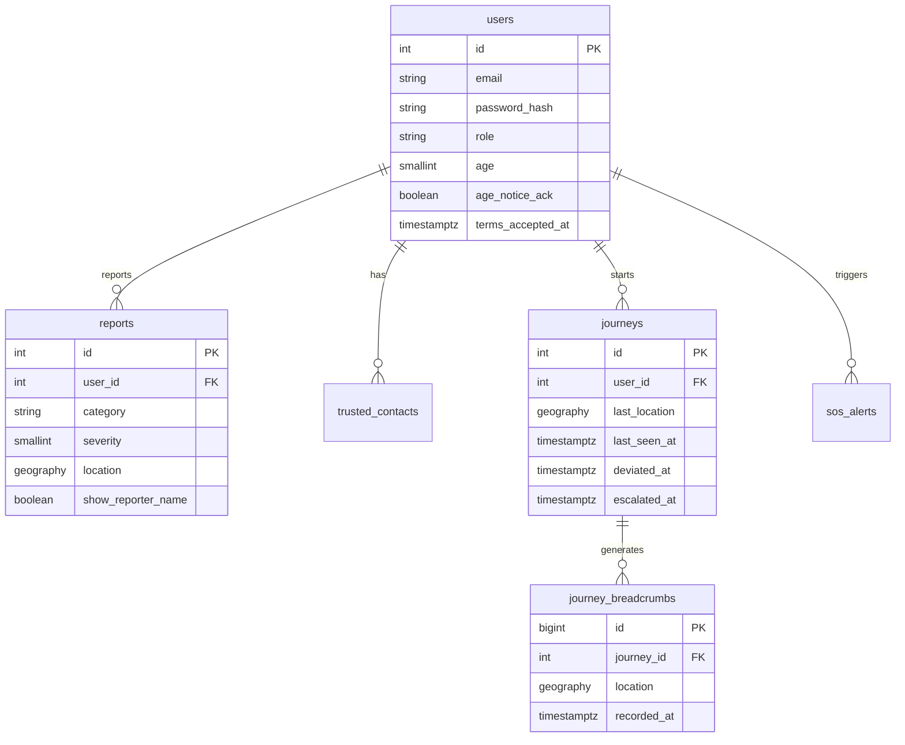

# Database Schema — V1

PostgreSQL + PostGIS on Neon. Schema is created inline in `initDatabase()` — V1 keeps that pattern (a real migration tool is a V2 engineering item) but every new column/table below should be added to that function and to a short `V1_CHANGES.sql` you keep in the repo for your report.

## 1. Existing tables (unchanged structure)

- `users` — id, name, email, password_hash, role, blood_group, emergency_contact, suspended, created_at, …
- `reports` — id, user_id, category, severity, description, photo_url, location `geography(Point,4326)`, confirmations_count, status, created_at
- `trusted_contacts` — id, user_id, name, email, phone
- `journeys` — id, user_id, origin/destination points, status, started_at, completed_at
- `sos_alerts` — id, user_id, location, battery, audio_url, status, source, created_at
- `notifications` — id, user_id, type, payload, read_at, created_at

## 2. New/changed in V1

```sql
-- Live tracking (Architecture §3)
CREATE TABLE journey_breadcrumbs (
  id BIGSERIAL PRIMARY KEY,
  journey_id INTEGER NOT NULL REFERENCES journeys(id) ON DELETE CASCADE,
  location GEOGRAPHY(Point,4326) NOT NULL,
  speed REAL,
  battery SMALLINT,
  recorded_at TIMESTAMPTZ NOT NULL DEFAULT now()
);
CREATE INDEX idx_breadcrumbs_journey ON journey_breadcrumbs (journey_id, recorded_at DESC);

-- Watchdog state (Architecture §4)
ALTER TABLE journeys
  ADD COLUMN last_location GEOGRAPHY(Point,4326),
  ADD COLUMN last_seen_at TIMESTAMPTZ,
  ADD COLUMN deviated_at TIMESTAMPTZ,
  ADD COLUMN escalated_at TIMESTAMPTZ;

-- Age notice + terms (no parental-consent workflow in V1 — see docs/v2)
ALTER TABLE users
  ADD COLUMN age SMALLINT,
  ADD COLUMN age_notice_ack BOOLEAN NOT NULL DEFAULT false,
  ADD COLUMN terms_accepted_at TIMESTAMPTZ;
```

## 3. Report response — identity stripped for public callers (API §Reports)

No schema change — `reports` still stores `user_id`. The change is in the **repository/DTO layer**: `findAll`/`nearby` must stop joining/returning `users.name`/`email`/`phone` unless the caller passed `requireStaff`. If you want this documented as a real flag rather than route-level logic, add:

```sql
-- Optional but recommended: lets a user choose to hide their name even from the "shown" default
ALTER TABLE reports ADD COLUMN show_reporter_name BOOLEAN NOT NULL DEFAULT true;
```
(Optional for V1 — only add it if you have time; otherwise identity is simply excluded from the public DTO server-side regardless of a stored preference, which still satisfies "admin sees who posted, public feed does not.")

## 4. Indexes to check exist (performance, not new features)

```sql
CREATE INDEX IF NOT EXISTS idx_reports_location ON reports USING GIST (location);
CREATE INDEX IF NOT EXISTS idx_journeys_status ON journeys (status) WHERE status = 'active';
```
The second index matters once the watchdog tick queries "active journeys" every 30 seconds — keep the active-journey list small and indexed so the tick stays cheap even as `journeys` grows.

## 5. Entity relationship (V1)



## 6. Deferred to V2 (do not build now)
`refresh_tokens`, `otp_codes`, `email_outbox`, `report_confirmations` (uniqueness), `alert_deliveries`, `checkins`, `contacts`/`threads`/`messages` (chat), `medical_cards`, `advisories`, `safe_places`, `place_audits`, `tracking_links`, `organizations`. Full definitions are in `docs/v2/database.md`.

## 7. Complete, runnable migration for V1

Save as `apps/backend/scripts/v1-migration.sql` (or run inline inside `initDatabase()` — either works, but keep a copy of this file in the repo either way as a record for your report). Written to be **idempotent** (`IF NOT EXISTS` throughout) so it's safe to re-run against a database that already has some of these changes applied.

```sql
-- ============================================================
-- Safora V1 migration — breadcrumbs, watchdog state, age/terms
-- ============================================================

BEGIN;

-- 1. Live tracking (architecture.md §3, tasks.md #4)
CREATE TABLE IF NOT EXISTS journey_breadcrumbs (
  id BIGSERIAL PRIMARY KEY,
  journey_id INTEGER NOT NULL REFERENCES journeys(id) ON DELETE CASCADE,
  location GEOGRAPHY(Point,4326) NOT NULL,
  speed REAL,
  battery SMALLINT,
  recorded_at TIMESTAMPTZ NOT NULL DEFAULT now()
);
CREATE INDEX IF NOT EXISTS idx_breadcrumbs_journey
  ON journey_breadcrumbs (journey_id, recorded_at DESC);

-- 2. Watchdog state (architecture.md §4/§6, tasks.md #7)
ALTER TABLE journeys
  ADD COLUMN IF NOT EXISTS last_location GEOGRAPHY(Point,4326),
  ADD COLUMN IF NOT EXISTS last_seen_at TIMESTAMPTZ,
  ADD COLUMN IF NOT EXISTS deviated_at TIMESTAMPTZ,
  ADD COLUMN IF NOT EXISTS escalated_at TIMESTAMPTZ;

-- Partial index: the watchdog and the admin radar both filter on status='active' constantly
CREATE INDEX IF NOT EXISTS idx_journeys_active
  ON journeys (status) WHERE status = 'active';

-- 3. Age notice + terms (tasks.md #10, #11) — no parental-consent workflow in V1
ALTER TABLE users
  ADD COLUMN IF NOT EXISTS age SMALLINT,
  ADD COLUMN IF NOT EXISTS age_notice_ack BOOLEAN NOT NULL DEFAULT false,
  ADD COLUMN IF NOT EXISTS terms_accepted_at TIMESTAMPTZ;

-- 4. Optional: per-report name visibility (only if you implement the toggle — see database.md §3)
ALTER TABLE reports
  ADD COLUMN IF NOT EXISTS show_reporter_name BOOLEAN NOT NULL DEFAULT true;

-- 5. Confirm PostGIS spatial index exists on reports (should already exist — verify, don't assume)
CREATE INDEX IF NOT EXISTS idx_reports_location ON reports USING GIST (location);

COMMIT;
```

### Rollback (for local dev only — think twice before running against any database with real data)
```sql
BEGIN;
ALTER TABLE reports DROP COLUMN IF EXISTS show_reporter_name;
ALTER TABLE users DROP COLUMN IF EXISTS terms_accepted_at, DROP COLUMN IF EXISTS age_notice_ack, DROP COLUMN IF EXISTS age;
DROP INDEX IF EXISTS idx_journeys_active;
ALTER TABLE journeys DROP COLUMN IF EXISTS escalated_at, DROP COLUMN IF EXISTS deviated_at, DROP COLUMN IF EXISTS last_seen_at, DROP COLUMN IF EXISTS last_location;
DROP TABLE IF EXISTS journey_breadcrumbs;
COMMIT;
```

### How to run it
- **Fresh database:** just start the backend — if you fold these statements into `initDatabase()`, they run automatically on boot.
- **Existing database with data (e.g. your deployed Neon instance):** connect with `psql` (or Neon's SQL editor in their dashboard) and run the migration script directly, once, before deploying the V1 backend code that depends on these columns/tables. Doing it in this order (schema first, code second) avoids the backend starting up against a schema it expects but doesn't yet have.

## 8. Data growth estimate (sanity check, not a hard requirement)
`journey_breadcrumbs` grows fastest — at a 5-second interval during an active walk, a 20-minute walk writes ~240 rows. At demo/submission scale (a handful of test walks) this is negligible; V2's retention policy (`docs/v2/database.md` §*, 30-day purge) is not needed for V1 but is worth keeping in mind if you leave the submission build running for weeks afterward — periodically truncate `journey_breadcrumbs` for old/completed journeys if the table grows large enough to notice.
