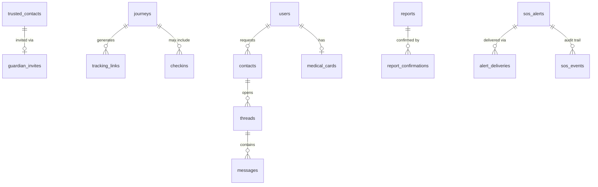

# Database Schema — V2 Additions

> New tables/columns introduced across V2, on top of V1's schema (`docs/v1/database.md`). Full `CREATE TABLE` statements are in the linked spec sections — this file is the index and the relationship map.

## New tables by feature

| Table | Purpose | Spec |
|---|---|---|
| `refresh_tokens` | Rotating session refresh tokens | `accounts-email-local.md` §3 (SEC-5) |
| `otp_codes` | Email verification / password reset codes | §1 |
| `email_outbox` | Queued transactional email | §1 |
| `guardian_invites` | Guardian handshake tokens | `safety-and-tracking.md` §1 |
| `alert_deliveries` | Per-channel SOS delivery tracking | §2 |
| `tracking_links` | Guardian web-view tokens (deferred feature) | §5 |
| `checkins` | Safety Check timers | §6 |
| `contacts` | Mutual accept for chat | §10 |
| `threads` / `messages` | Chat | §10 |
| `medical_cards` | Encrypted emergency medical info | `accounts-email-local.md` §8 |
| `report_confirmations` | Unique "still there/cleared" votes | §2 (SEC-3), `map-routing-search.md` §9 |
| `advisories` | Sachet/manual disaster advisories | `accounts-email-local.md` §6.2 |
| `safe_places` | Police/hospital/pharmacy overlay | `map-routing-search.md` §7 |
| `place_audits` | SafetiPin-style safety ratings | `accounts-email-local.md` §6.3 |
| `organizations` | Campus/org scoping for admin (deferred) | §7 (ADM-2) |
| `sos_events` | Admin dispatch audit trail | §7 (ADM-1) |

## New tables — added 22 Sep 2026

| Table | Purpose | Spec |
|---|---|---|
| `weather_cache` | Short-TTL cache of Open-Meteo responses | `environmental-hazards.md` §2 (WX-1) |
| `abuse_flags` | Moderator-flagged accounts, admin-reviewed queue | `accounts-email-local.md` §8 (SEC-10) |
| `parent_links` | Consent authority for teen accounts (relationship, not role) | §4 (AGE-2) |
| `sos_escalation_state` | Tracks which tier an SOS's escalation ladder is on | `safety-and-tracking.md` §2 (TRK-11) |
| `battery_warnings` | One row per battery-threshold crossing during a walk | §6b (TRK-10) |
| `scheduled_walks` | Recurring Safe Walk reminders (local-notification driven) | §6d (TRK-13) |

## Column additions to existing tables

| Table | New columns | Spec |
|---|---|---|
| `users` | `email_verified_at`, `email_bounced_at`, `token_version`, `language` | `accounts-email-local.md` §1 |
| `trusted_contacts` | `status`, `guardian_user_id`, `accepted_at`, `revoked_at`, `language` | `safety-and-tracking.md` §1 |
| `journeys` | `mode`, `last_location`, `last_seen_at` *(already in V1)*, `deviated_at`/`escalated_at` *(already in V1)*, `escalation_reason`, `type` (`safe_walk`\|`walk_with_me`, added 22 Sep 2026) | §3, §4, §6c |
| `trusted_contacts` | `priority_tier` (added 22 Sep 2026 — escalation ladder) | `safety-and-tracking.md` §1, §2 |
| `users` | `trust_score` (added 22 Sep 2026 — reporter trust) | `map-routing-search.md` §9 (MAP-9c) |
| `reports` | `duplicate_of` (added 22 Sep 2026) | §9 (MAP-9d) |
| `reports` | (category-specific decay handled in application code, not schema) | `map-routing-search.md` §9 |

## Entity relationship (V2 additions only)

## Retention (see `security-privacy-compliance.md` §2 for the full table)
Breadcrumbs 30 days, SOS audio 30 days, chat messages 30 days after last activity, OTP codes purged 24h after use/expiry, tracking links purged 30 days after expiry. A scheduled purge job (`ENG-1`) is required once these tables exist — do not ship the tables without it.

## Migration ordering note

Apply V2 migrations in the same order as the implementation sequence above — e.g. `refresh_tokens`/`otp_codes` (session + email) before `guardian_invites` (which assumes verified-email accounts exist), before `contacts`/`threads`/`messages` (chat, which assumes the guardian handshake pattern is already proven). Use a real migration tool for this phase (`node-pg-migrate`, tracked as `ENG-1` in `roadmap.md`) rather than V1's inline-SQL-in-`initDatabase()` pattern — V2 has enough schema changes that hand-tracking them stops being safe.
