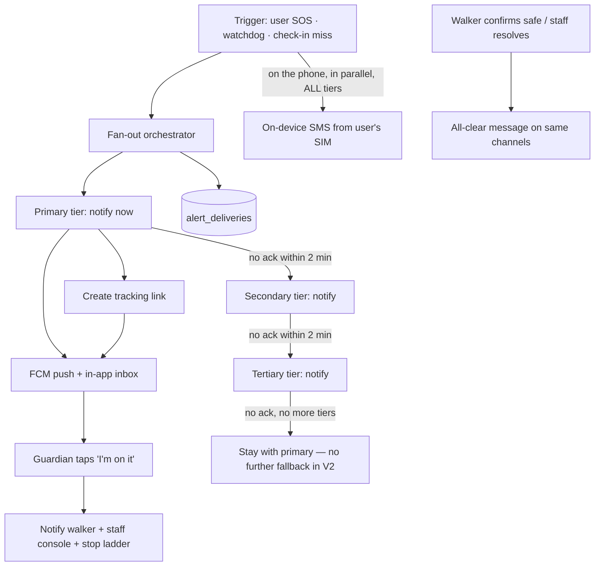
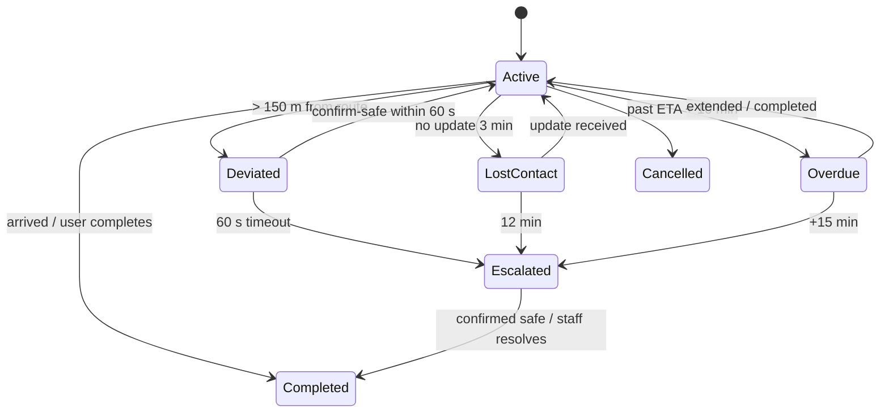

# Specs: Safety, Tracking and Triggers

> Covers ACC-5, TRK-1…TRK-13, TRG-1…TRG-6, CHT-1…CHT-4. **v2 (21 Sep 2026):** Telegram dropped (guardians use the Safora app); tracking link deferred; chat re-scoped into three stages. **Updated 22 Sep 2026:** escalation ladder (TRK-11) replaces "notify everyone at once"; battery dead-man's switch (TRK-10), "walk with me" (TRK-12), scheduled walks (TRK-13), and a chat duress codeword (CHT-4) added. Tags: ✅ verified · 📄 documented only · 🔬 needs test · 🗓 planned. All items below are 🗓 unless marked.
> Reasoning and sources: `07-architecture-decisions.md`, `09-references.md`.

## 1. Guardian model (ACC-5)

### Goal
Only people who have **explicitly accepted** can receive someone's location or alerts. Today any account that registers with a matching email or phone starts receiving that person's SOS alerts, so a stranger who signs up first could intercept them (`docs/safety-algorithms.md` §8 admits this) ✅.

### Contact channels (v2 — app-first)
Decision Y3: **no Telegram**; guardians use the Safora app, so the app itself grows. A contact (`trusted_contacts` row) is reachable through these channels, each with its own consent step:

| Channel | Who it suits | Consent step | Cost |
|---|---|---|---|
| **App** (FCM push + in-app inbox) | Guardian has Safora | Guardian accepts the invitation inside their verified account | Free |
| **On-device SMS** (safety net) | Any phone number the walker entered | Walker confirms the number; guardian can ask the walker to stop | Walker's SIM plan; APK build only |
| **Web tracking link** (deferred, §5) | Guardian without the app | None needed (link is private, expiring, revocable) | Free |

A guardian who does not have Safora yet is invited by a share message with the download link (the GitHub release page). Installing an APK is real friction, so the SMS safety net still reaches them during an SOS even before they install.

### Status model
`trusted_contacts.status`: `pending` → `verified` → `revoked`.
- `pending`: created by the walker; invitation sent. **No location and no SOS content is sent** except the single drill/invite message.
- `verified`: guardian accepted in the app. Receives alerts through the app.
- `revoked`: guardian left, or walker removed them. Immediately excluded from all fan-out and tracking links.
- SMS-only contacts (no Safora account) stay `pending`; they still receive the SOS **SMS** because the walker chose to send it from their own phone (explicit walker consent, documented in the UI), but nothing else.

### Rules
1. Invitation by app requires the guardian's **verified** email (ACC-2). An unverified account cannot be matched.
2. The walker sees each guardian's state (App ✅ / SMS only / Pending).
3. Guardians can **leave** at any time from the app (`DELETE /api/guardian/links/:id`); the walker is notified.
4. Rate limit: 10 new invitations per user per day; a guardian can report "I don't know this person" which blocks that sender.
5. A guardian is told exactly what they will receive ("live location during Safe Walks you start, and SOS alerts").

### Data model
```sql
ALTER TABLE trusted_contacts
  ADD COLUMN status VARCHAR(20) NOT NULL DEFAULT 'pending',   -- pending|verified|revoked
  ADD COLUMN guardian_user_id INTEGER REFERENCES users(id),   -- set when accepted in-app
  ADD COLUMN accepted_at TIMESTAMPTZ,
  ADD COLUMN revoked_at TIMESTAMPTZ,
  ADD COLUMN language VARCHAR(5) DEFAULT 'en',
  ADD COLUMN priority_tier SMALLINT NOT NULL DEFAULT 1;       -- 1=primary, 2=secondary, 3=tertiary — added 22 Sep 2026, see §2 "Escalation ladder"

CREATE TABLE guardian_invites (
  id UUID PRIMARY KEY, contact_id INTEGER NOT NULL REFERENCES trusted_contacts(id) ON DELETE CASCADE,
  channel VARCHAR(20) NOT NULL,          -- app|email
  token_hash TEXT NOT NULL, expires_at TIMESTAMPTZ NOT NULL, used_at TIMESTAMPTZ, created_at TIMESTAMPTZ DEFAULT now()
);
```
The walker sets `priority_tier` when adding/editing a contact (defaults everyone to `1`/primary if never touched, preserving today's "everyone gets notified" behaviour until the walker deliberately organises their contacts — see §2 for how this actually changes delivery).

### API
| Endpoint | Purpose |
|---|---|
| `POST /api/sos/contacts` (existing) | Creates contact as `pending`, triggers invites |
| `POST /api/guardian/invites/:token/accept` | Guardian accepts in-app |
| `GET /api/guardian/links` | Guardian lists people who added them |
| `DELETE /api/guardian/links/:id` | Guardian leaves |
| `POST /api/sos/contacts/:id/resend` | Re-send invite (cooldown 10 min) |

### Acceptance criteria
- A second account registered with a guardian's email **before** the real guardian cannot receive alerts unless it holds a verified email.
- A `pending` or `revoked` contact receives nothing during a test SOS.
- Walker UI shows the correct channel state within 5 s of acceptance.

---

## 2. Alert fan-out orchestrator (TRK-9) and the escalation ladder (TRK-11)

### Goal
An SOS or escalation event reaches guardians through every available channel, with delivery tracking, guardian acknowledgement, and an all-clear message. **Changed 22 Sep 2026 (your decision):** delivery is no longer "every verified guardian at once" — it follows a **priority ladder**, primary tier first.



### Escalation ladder — behaviour (TRK-11, your decisions)
1. **SOS goes to the primary tier (`priority_tier = 1`) first** — all channels for every primary contact, immediately. This applies to **every** SOS, manual button-press and watchdog-triggered alike, not just watchdog escalations.
2. **Wait 2 minutes** for any primary contact to acknowledge ("I'm on it"). The first ack from *any* tier stops the ladder — no further tiers are notified once someone has responded.
3. **No primary ack after 2 minutes** → notify the secondary tier (`priority_tier = 2`), same channels, same 2-minute wait.
4. **No secondary ack after 2 minutes** → notify the tertiary tier (`priority_tier = 3`), same pattern.
5. **If a walker has no secondary/tertiary contacts set** (or all tiers have been exhausted with no ack), **the ladder stays with primary — it does not fall back to notifying everyone at once.** This is a deliberate choice (yours): simpler behaviour, and it avoids a confusing "suddenly everyone gets pinged" moment. The trade-off — if primary truly can't respond and there's no secondary tier, the alert stays only with primary — is accepted for V2. **If a walker sets only one contact, they are effectively "primary" and there is no ladder to climb; document this in the app UI** ("add a secondary contact to enable escalation") so it's not a silent gap.
6. **On-device SMS (TRK-8) still goes to everyone regardless of tier**, in parallel, from the moment of trigger — it's a phone-originated safety net, not part of the server-orchestrated ladder, and there's no reason to delay it by tier since it costs nothing extra to fire immediately.
7. **Every SOS still creates a tracking link** and follows the drill/idempotency/acknowledgement/all-clear rules below — the ladder only changes *when each tier's app/push notification fires*, not the rest of the delivery mechanics.

### Forward reference — V3's offline mesh messaging (see `docs/v3/02-offline-emergency-messaging.md`)
You connected this yourself: **"in V3 when we add offline, then it go through offline in a range of that if primary not available."** Documenting that link now: once/if V3's mesh messaging exists, "primary unreachable through normal channels (no push delivery, no SMS delivery confirmation) *and* no cell/data signal" is exactly the condition under which a last-resort mesh-relay tier would make sense — try reaching anyone in Bluetooth/Wi-Fi Direct range (not necessarily a guardian) as a final fallback beyond "stay with primary." **Not built now** — this is a note for whoever picks up V3's mesh work later, so the escalation ladder and the mesh system are designed to fit together rather than needing retrofitting.

### Behaviour (unchanged from before, still applies per-tier)
1. **Parallel, independent channels within a tier.** A failure in one never blocks another. Each channel retries 3× with exponential back-off (honouring provider back-off headers).
2. **Idempotency:** every event has an `event_id`; guardians receive one message per channel per event; repeated watchdog ticks never re-send.
3. **Message content:** walker's first name, time, coordinates as a map link, battery %, audio link (signed URL) if present, tracking link, event type. No phone number of the walker unless the guardian already has it.
4. **Acknowledgement:** "I'm on it" button in the app. First ack (from any tier) notifies the walker, shows in the staff console, and halts the ladder (§ above).
5. **All-clear:** when the walker confirms safe or staff resolves, send a short resolution message to **every tier that was actually notified** and **expire the tracking link**.
6. **Drills** (`is_test`) go through the same code path (ladder included, so drills are a real test of tier timing), labelled `[DRILL]`, and never create staff pages.

### Data model
```sql
CREATE TABLE alert_deliveries (
  id BIGSERIAL PRIMARY KEY, event_id UUID NOT NULL, sos_id INTEGER REFERENCES sos_alerts(id) ON DELETE CASCADE,
  contact_id INTEGER REFERENCES trusted_contacts(id) ON DELETE SET NULL,
  tier SMALLINT NOT NULL,              -- 1|2|3, matches trusted_contacts.priority_tier at time of send
  channel VARCHAR(20) NOT NULL,        -- fcm|sms|link
  status VARCHAR(20) NOT NULL,         -- queued|sent|failed|delivered|acked
  error TEXT, attempts INT DEFAULT 0, sent_at TIMESTAMPTZ, acked_at TIMESTAMPTZ, created_at TIMESTAMPTZ DEFAULT now()
);
CREATE INDEX ON alert_deliveries (event_id);

CREATE TABLE sos_escalation_state (
  sos_id INTEGER PRIMARY KEY REFERENCES sos_alerts(id) ON DELETE CASCADE,
  current_tier SMALLINT NOT NULL DEFAULT 1,
  tier_notified_at TIMESTAMPTZ NOT NULL DEFAULT now(),
  acked_at TIMESTAMPTZ,               -- set on first ack from any tier; ladder halts once this is set
  updated_at TIMESTAMPTZ DEFAULT now()
);
```
A simple timer (reusing the existing watchdog tick's 30-second cadence, `docs/v1/architecture.md` §4/§6 — same in-process pattern) checks `sos_escalation_state` rows every tick: if `acked_at IS NULL` and `now() - tier_notified_at > 2 minutes` and `current_tier < 3` and there's a contact at the next tier, advance `current_tier` and notify. If `current_tier = 3` (or no contact exists at the next tier) and still no ack, do nothing further — this **is** the "stay with primary" behaviour, expressed as "no more tiers to advance to."

SMS rows are reported back by the phone (`POST /api/sos/:id/sms-status`) so staff can see whether the walker's phone actually sent them.

### Acceptance criteria
- A walker with 3 tiered contacts, none acknowledging: primary notified at T+0, secondary at T+2min, tertiary at T+4min, then nothing further.
- Any tier's "I'm on it" halts further tier advancement, confirmed by `sos_escalation_state.acked_at` being set and no further `alert_deliveries` rows created after that point.
- A walker with only a primary contact set: primary is notified once, ladder does not advance (no secondary exists), no error/crash.
- On-device SMS fires immediately regardless of tier state, confirmed by an SMS delivery row with `sent_at` close to the trigger time even when `current_tier` is still `1`.
- Staff console shows per-channel, per-tier status for each guardian within 10 s.

---

## 3. Breadcrumbs, sockets and live radar (TRK-1, TRK-2, TRK-3)

### Current problem ✅
`JourneyService.updateLocation` computes the deviation but never stores the coordinates; the phone never connects to Socket.IO; `getActiveJourneys` returns the origin as "current location".

### Data model
```sql
CREATE TABLE journey_breadcrumbs (
  id BIGSERIAL PRIMARY KEY, journey_id INTEGER NOT NULL REFERENCES journeys(id) ON DELETE CASCADE,
  location GEOGRAPHY(Point,4326) NOT NULL, speed REAL, accuracy REAL, battery SMALLINT,
  recorded_at TIMESTAMPTZ NOT NULL DEFAULT now()
);
CREATE INDEX ON journey_breadcrumbs (journey_id, recorded_at DESC);

ALTER TABLE journeys
  ADD COLUMN mode VARCHAR(10) DEFAULT 'walk',             -- walk|bike|scooter|car
  ADD COLUMN last_location GEOGRAPHY(Point,4326),
  ADD COLUMN last_seen_at TIMESTAMPTZ,
  ADD COLUMN deviated_at TIMESTAMPTZ,
  ADD COLUMN escalated_at TIMESTAMPTZ,
  ADD COLUMN escalation_reason VARCHAR(30);
```

### Behaviour
- `PATCH /api/journeys/:id/location` inserts a breadcrumb, updates `last_location`/`last_seen_at`, evaluates the corridor, and emits `journey:location` to rooms `staff`, `journey:{id}` and (via link token) `track:{linkId}`.
- Mobile opens **one** authenticated socket after login (JWT in the handshake, as the server already requires ✅), joins the active journey room, and falls back to REST-only if the socket drops (positions are still sent by REST).
- Update interval: walk 5 s, bike/scooter/car 3 s; pause updates when the phone is stationary for 60 s and send a heartbeat every 30 s instead (saves battery, keeps `last_seen_at` fresh).
- Retention: breadcrumbs older than 30 days deleted by a scheduled job (`06` §2).

### Acceptance criteria
- Walking with the app open produces a row every ~5 s and a moving marker in the admin radar with < 3 s lag.
- The admin radar never shows sample data when the backend is reachable (SEC-9).

---

## 4. Watchdog engine (TRK-4)

### Goal
Escalation that does not depend on the phone staying alive. This is the biggest safety gap in the current app (finding #10) ✅.

### Rules
| Rule | Detects | Step 1 | Step 2 | Step 3 |
|---|---|---|---|---|
| **Deviation** | Server sets `deviated` (> 150 m from route) | Push + in-app prompt "Are you OK?" | If no `confirm-safe` within **60 s** → **escalate** | — |
| **Lost contact** | Active journey, `last_seen_at` older than **3 min** | Push to walker ("still there?") | **6 min:** soft notice to guardians ("last seen at …", no SOS) | **12 min:** full escalation |
| **Overdue** | `now > expected_arrival_at + 10 min` | Push "Still walking? Extend or complete" | **+5 min** without reply → soft notice to guardians | **+10 min** → full escalation |
| **Check-in miss** (TRK-5) | Timer passes `due_at` | Push + 60 s countdown | Escalate | — |

All numbers are **defaults, configurable** (remote config or env), and are to be tuned in the pilot. Hill areas have dead zones, so *lost contact* is deliberately gentler than *deviation* (risk R-3).

### Escalation action
1. Set `escalated_at`, `escalation_reason` (`deviation|lost_contact|overdue|checkin`), write an `escalation_events` row.
2. Create an SOS alert with `source='watchdog'`, location = last known point, and start the fan-out (§2).
3. Create a tracking link (§5) and include it.
4. Keep watching: if the walker reconnects and confirms safe, send the all-clear.



### Runtime design (ADR-007)
- In-process scheduler tick every 30 s inside the Express service. The list of **active journeys is held in memory**, loaded from the database at boot and updated on start/complete/cancel/location events, so an idle tick makes **no database query**.
- Render's free web service sleeps after 15 minutes idle [R41]. An external pinger (Cloudflare Worker cron or cron-job.org) calls `POST /api/internal/tick` with a secret header every minute; the tick endpoint also runs the check. Upgrading to a paid always-on instance removes the pinger requirement.
- Because the service can restart at any time, every rule is **idempotent** and driven by timestamps stored in the database, not by in-memory timers.

### API additions
`POST /api/journeys/:id/confirm-safe` · `GET /api/journeys/:id/status` · `POST /api/internal/tick` (secret header, not user-authenticated).

### Acceptance criteria (each tested by simulation and on a real phone)
- Force-stop the app during a walk → guardians get a *lost contact* notice at ~6 min and escalation at ~12 min (with default settings).
- Walk > 150 m off route and ignore the prompt → escalation within 60 ± 5 s **with the app killed**.
- Restart the backend during a walk → no duplicate alerts, no missed alerts.
- Escalation never fires twice for the same journey.

---

## 5. Guardian live-tracking link (TRK-6) — **deferred to M8**

> v2: because guardians are now expected to use the app, the web link is optional. Build it only if beta testers say guardians without the app matter. The design below stays valid.

### Goal
A guardian without the app follows a walk in any browser. Designed so a leaked link does limited harm.

### Token and lifetime
- 128-bit random token in the URL (`/t/<token>`), only its SHA-256 hash is stored.
- Separate from the login JWT; grants read-only access to **one** journey/SOS.
- Expires 30 minutes after the walk ends; SOS links expire 6 hours after the last update. The walker can **revoke** at any time from the app.

```sql
CREATE TABLE tracking_links (
  id UUID PRIMARY KEY, journey_id INTEGER REFERENCES journeys(id) ON DELETE CASCADE,
  sos_id INTEGER REFERENCES sos_alerts(id) ON DELETE CASCADE, checkin_id INTEGER,
  token_hash TEXT NOT NULL UNIQUE, created_by INTEGER REFERENCES users(id),
  created_at TIMESTAMPTZ DEFAULT now(), expires_at TIMESTAMPTZ NOT NULL, revoked_at TIMESTAMPTZ,
  last_viewed_at TIMESTAMPTZ, view_count INT DEFAULT 0
);
```

### What the viewer shows
Walker's **first name**, current position on the map, last update time ("12 s ago"), status banner (On route / Off route / Lost contact / SOS), destination name if the walker allows it, battery % (walker toggle). **No phone number, no history trail.** During an escalation, the last 15 minutes of trail are shown to help responders.

### Endpoints and hardening
| Endpoint | Notes |
|---|---|
| `GET /api/track/:token` | Returns the minimal state above. Rate limit 60/min/IP. `Cache-Control: no-store`, `X-Robots-Tag: noindex`. Same 404 for unknown, expired and revoked tokens |
| Socket room `track:{linkId}` | Joined with the token, not a JWT; receives only position/status events |
| `POST /api/journeys/:id/tracking-links` | Walker creates/refreshes a link |
| `DELETE /api/tracking-links/:id` | Walker revokes |

The viewer is a public route in the existing admin static site (`/t/:token`), so it costs nothing extra.

### Acceptance criteria
- A link stops working within 5 s of revocation and after expiry.
- The viewer page discloses no field beyond those listed (checked in a test that snapshots the JSON).
- Brute-forcing tokens is rate-limited and returns no timing difference between "unknown" and "expired".

---

## 6. Check-in timer — "Safety Check" (TRK-5)

Modelled on Google's Personal Safety **Safety Check**, which asks you to confirm you are safe before a timer ends and starts emergency sharing if you do not [R3][R4], and lets you add time [R5].

### Flow
1. User picks a reason (Walking alone, Meeting someone, Hiking, Travelling), a duration (15 min – 8 h) and which guardians to notify.
2. Reminder push at `due_at − 5 min`.
3. At `due_at`: push + full-screen prompt with 60 s countdown: **I'm safe**, **Add 15 minutes** (max 3 times), **Need help**.
4. No response → the watchdog escalates as in §4 (check-in miss), starting a tracking link.
5. "I'm safe" resolves; guardians who were told about the check are sent a short "all good".

```sql
CREATE TABLE checkins (
  id SERIAL PRIMARY KEY, user_id INTEGER NOT NULL REFERENCES users(id) ON DELETE CASCADE,
  reason VARCHAR(30), due_at TIMESTAMPTZ NOT NULL, extensions SMALLINT DEFAULT 0,
  contact_ids INTEGER[] DEFAULT '{}', status VARCHAR(20) DEFAULT 'active', -- active|resolved|escalated|cancelled
  created_at TIMESTAMPTZ DEFAULT now(), resolved_at TIMESTAMPTZ
);
```

### Acceptance criteria
- A check-in set for 15 minutes escalates at 16 minutes with the phone switched off.
- Extending three times works; a fourth extension is refused.

---

## 6b. Battery dead-man's switch (TRK-10, added 22 Sep 2026)

### Goal
If the phone's battery is about to die during an active Safe Walk, send guardians a last-known-location message **before** it actually dies — rather than the watchdog only catching the resulting silence several minutes later via the lost-contact rule (§4).

### Flow (your decisions: 30s cancel window, repeats every 5% drop)
1. During an active Safe Walk, the phone monitors its own battery level (standard OS battery API, already partially used since battery % is already sent with location updates).
2. **Each time battery level crosses a 5%-drop threshold** while below a starting ceiling (e.g. first triggers at 20%, then again at 15%, 10%, 5% — configurable starting point, tune during testing) **and while still in an active Safe Walk**, show a full-screen prompt: *"Your battery is at 15%. We'll send your location to your guardians in 30 seconds unless you cancel."*
3. **30-second cancel window**, same UX pattern as the existing SOS cancel countdown — reuse that component rather than building a second one.
4. If not cancelled: send a **battery-warning alert** (distinct type from a full SOS — no audio recording attempt, no escalation ladder, just a single message: "battery low, last known location: <link>") to the walker's **primary tier only** (consistent with the escalation ladder's primary-first principle — this is a warning, not a full emergency, so it doesn't need the ladder's multi-tier logic).
5. **Repeats at each subsequent 5% threshold crossed**, each time with its own fresh 30-second cancel window — this is deliberately not a one-time trigger, since a battery genuinely running out is an escalating situation, but each repeat is still cancellable so it doesn't become an unstoppable nuisance if the user is fine and just hasn't charged their phone.
6. Stops entirely when the walk completes/cancels, or if the phone actually dies (nothing more to do at that point — this is exactly the scenario the watchdog's lost-contact rule, §4, is the ultimate safety net for).

### Data model
```sql
CREATE TABLE battery_warnings (
  id BIGSERIAL PRIMARY KEY, journey_id INTEGER NOT NULL REFERENCES journeys(id) ON DELETE CASCADE,
  battery_level SMALLINT NOT NULL, sent BOOLEAN NOT NULL DEFAULT false,
  cancelled BOOLEAN NOT NULL DEFAULT false, created_at TIMESTAMPTZ DEFAULT now()
);
```
One row per threshold crossing per journey — lets you see in testing/analytics exactly how often this fires and how often it's cancelled (useful for tuning the starting threshold later).

### Acceptance criteria
- Battery simulated dropping from 22% → 19% during an active walk: prompt appears at the 20% crossing, not before.
- Cancelling within 30s sends nothing; letting it expire sends exactly one message to primary-tier guardians.
- Battery continuing to drop to 14% triggers a second, independent prompt/cancel window.
- No prompt appears when there's no active Safe Walk, regardless of battery level (this is walk-specific, not a general low-battery nag).

---

## 6c. "Walk with me" live request (TRK-12, added 22 Sep 2026)

### Goal
A lighter-weight alternative to a full pre-planned Safe Walk, for a spontaneous short need — "stay with me for the next 10 minutes" rather than requiring a destination and route.

### Flow
1. User taps "Walk with me" (no destination required), picks a duration (5–30 min) and which guardian(s) to ask.
2. Notifies whichever of the selected guardians are currently online/reachable (app open or recently active — reuse presence signal if one already exists from the socket connection, or simply push to all and let whoever sees it respond).
3. Any guardian who accepts sees a simplified live-location view (reuses the same map component as the full guardian live-tracking view, `docs/v1/architecture.md` §3/§5) for the duration, with no route/corridor/deviation logic — this is presence-sharing, not route-following.
4. Ends automatically at the chosen duration, or early if the user taps "Done."
5. No watchdog escalation tied to this (it's explicitly lighter-weight) — if you want deviation-style safety guarantees, that's what the full Safe Walk is for.

### Data model
Reuses `journeys` with a new `type` column rather than a separate table, since it shares most of the same tracking machinery:
```sql
ALTER TABLE journeys ADD COLUMN type VARCHAR(20) NOT NULL DEFAULT 'safe_walk'; -- safe_walk|walk_with_me
```
`walk_with_me` journeys skip route/corridor fields entirely (`route_polyline`, `deviated_at` stay unused/null) and are excluded from the watchdog's deviation rule (§4) — only from the lost-contact rule if you choose to apply it (your call whether a `walk_with_me` session should also get lost-contact protection; simplest V2 default is no, since it's meant to be lightweight).

### Acceptance criteria
- Starting a "walk with me" request with no destination succeeds (unlike a full Safe Walk, which requires one).
- A guardian who accepts sees the live marker; one who ignores it sees nothing further.
- The session ends automatically at the chosen duration with no lingering tracking.

---

## 6d. Scheduled/recurring Safe Walks (TRK-13, added 22 Sep 2026)

### Goal
Remind the user to start tracking for a route/time they walk regularly, rather than relying on them remembering.

### Flow
1. After completing a Safe Walk, offer "Make this a regular walk?" with a day-of-week + time picker (or the user sets this up manually from a "Scheduled Walks" screen).
2. A local device notification/reminder fires a few minutes before the scheduled time: "Time for your usual walk — start Safe Walk tracking?" — **this is a reminder, not an automatic start**; the user still has to confirm, since auto-starting location tracking without an explicit action each time would be a consent problem (`docs/v2/security-privacy-compliance.md` §5, D1: "no tracking without a walker-started action").
3. Tapping the reminder pre-fills a new Safe Walk with the saved route/destination.

### Data model
```sql
CREATE TABLE scheduled_walks (
  id SERIAL PRIMARY KEY, user_id INTEGER NOT NULL REFERENCES users(id) ON DELETE CASCADE,
  destination_lat DOUBLE PRECISION, destination_lng DOUBLE PRECISION, destination_label TEXT,
  day_of_week SMALLINT[] NOT NULL,     -- 0=Sunday..6=Saturday, can repeat on multiple days
  time_of_day TIME NOT NULL, active BOOLEAN NOT NULL DEFAULT true,
  created_at TIMESTAMPTZ DEFAULT now()
);
```
Implemented as local device-scheduled notifications (no server-side cron needed — this is purely a reminder, the server doesn't need to know about the schedule until the user actually starts a walk from it).

### Acceptance criteria
- A scheduled walk for "Mon/Wed/Fri, 9:00 PM" produces a reminder notification at the right time on those days only.
- Tapping the reminder opens a pre-filled Safe Walk start screen, not an already-started walk.

---

## 7. Telegram alert bot (TRK-7) — **dropped**

Dropped on 21 Sep 2026 (decision Y3): guardians use the Safora app. Nothing to build. If guardian reach without the app becomes a problem later, prefer the web tracking link (§5) before reconsidering a messaging bot.

## 8. On-device SMS from the user's SIM (TRK-8)

### Why
It is the only free way to send an **automatic** SMS in India. Because it is person-to-person from the user's own SIM, it does not go through the template registration India requires for application-to-person SMS [R30]. It also works with **no internet** if cell signal exists — the case the current `sms:` composer handles badly because the user must tap Send ✅.

### Design
- Android `SmsManager` through a small native module; permission `SEND_SMS` declared **only in the APK build flavour**. Google Play restricts SMS permissions to default SMS/phone/assistant handlers with narrow exceptions [R14], so a future Play build removes this module (ADR-005).
- SMS text ≤ 2 segments: `Name needs help. Live: <tracking link> Map: https://maps.google.com/?q=lat,lng Battery 68%. Sent by Safora.`
- Multi-SIM: use the SIM the user has set for SMS; show which one in Settings.
- Delivery: register sent/delivered intents; report each result to the server (`sms-status`) so staff see it; if no signal, queue and retry when signal returns for up to 10 minutes.
- Cost note in the UI: standard SMS charges of the user's plan apply.
- Runs **in parallel** with the server fan-out, never instead of it.

### 🔬 Verify
Behaviour of the runtime permission prompt and of background sending on a sideloaded APK on Android 12–14 (Samsung, Xiaomi, Realme).

### Acceptance criteria
- In airplane-mode-off / data-off / SIM-on, an SOS sends SMS to all `verified` and SMS-only contacts without any tap after the countdown.
- The result of each SMS appears in the staff console after the phone regains internet.

---

## 9. No-unlock SOS triggers (TRG-1…TRG-6)

### Context (what India and Android already do)
- Indian smartphones are required to support a **power-button panic** that calls 112 (three quick presses) [R1][R47]. Safora does **not** intercept the power button. Onboarding should tell the user to keep that feature on; Safora adds the guardians, the audio, and the tracking link.
- Google's Personal Safety app offers a five-press power-button Emergency SOS on many Android phones [R3]. Safora should not duplicate it; onboarding can mention it.

### Trigger set (layered, all optional except the in-app button)
| # | Trigger | Works when locked? | Notes |
|---|---|:---:|---|
| 1 | In-app SOS button (existing) | No | Already built ✅ |
| 2 | **Persistent notification action** ("SOS") while a Safe Walk or Guard mode is active | Yes | Foreground-service notification; no special permission |
| 3 | **Quick Settings tile** | Usually 🔬 | Some devices ask to unlock before a tile action; test per OEM |
| 4 | **Home-screen widget** | No (unlocked only) | Fast from the home screen |
| 5 | **Volume pattern** (default: Volume Up, Volume Up, Volume Down within 1.5 s) | Yes | Needs an AccessibilityService; see below |
| 6 | **Shake** (opt-in) | Yes if Guard runs | Accelerometer threshold; high false-positive risk, opt-in only |
| 7 | Decoy calculator duress PIN (existing) | No | Already built ✅; make PIN per user (SEC-7) |

### Native architecture (Kotlin)
```
React Native app ──login──► writes token to Android Keystore-backed storage (TRG-1)
Guard foreground service ──► listens for tile/notification/shake/volume events
Any trigger ─► NativeSosSender:
    1. vibrate pattern + 3 s cancel window (notification action "Cancel")
    2. read last known location (LocationManager / fused), battery
    3. HTTPS POST /api/sos with stored token (no React Native needed)
    4. in parallel: SmsManager to guardians (TRK-8)
    5. try audio evidence (see TRG-6)
    6. on HTTPS failure: retry queue + SMS already sent
```
Running without the React Native bridge matters: the JS engine may not be alive on a locked phone.

### Volume-pattern trigger (TRG-4) — how and why it is opt-in
- Reliable detection of volume keys in the background is done with an AccessibilityService key-event filter; other approaches rely on tricks (silent media sessions, volume observers) that need "Unrestricted" battery use and have blind spots when volume is at its minimum or maximum [R15][R16].
- The service must declare only key-event filtering (no window-content access), be enabled manually by the user in system settings, and be **disclosed clearly in-app** before the user is sent there. Google Play's policy expects prominent disclosure and use of narrower APIs where possible [R13] — not binding on an APK, but the same rules make it trustworthy.
- 🔬 Android 13+ adds an extra "allow restricted settings" step for sideloaded apps before an accessibility service can be enabled; confirm on test phones and document the exact taps in onboarding.
- Kill switch: a Settings toggle stops the service; the app shows a persistent notice while it is active.

### Foreground service (TRG-2) and Android limits [R11][R12]
- Declare foreground service types (`location`, and only what is truly needed). The permission for a foreground service that uses location, camera or microphone is a "while-in-use" permission, so **such a service generally cannot be started from the background**; it must be started while the app is visible (for example when the user turns on Guard mode or starts a Safe Walk).
- Background location access is only granted if the user allows "Allow all the time"; without it, a location service cannot be created from the background.
- Play policy accepts foreground-service location use when it continues a user-started action and stops when that action ends [R42]; Safe Walk fits. A permanent Guard mode is acceptable in an APK but should be clearly user-controlled.
- **Battery managers:** Xiaomi/MIUI needs Autostart and no battery restrictions; Oppo/Vivo/OnePlus/Huawei clean up aggressively; settings can reset after system updates [R17]. Onboarding checklist (TRG-2): request battery-optimisation exemption, open the OEM autostart screen, link to the device-specific guide. The **server watchdog remains the safety net** (§4).

### Locked-screen audio evidence (TRG-6, spike 🔬)
A microphone foreground service generally cannot be started from the background [R12]. Test three approaches and record results per device:
| Approach | Idea | Expected risk |
|---|---|---|
| A | Guard service started while the app was visible keeps its while-in-use access; on trigger it starts the recorder | May work on some Android versions; kill by OEM |
| B | Trigger launches a transparent activity shown over the lock screen; the recorder starts from that visible activity | Needs full-screen-intent permission on Android 14+ |
| C | Send SOS without audio immediately; record later when the screen wakes | Always works; loses early audio |
**Decision rule:** ship whichever of A/B works on ≥ 80 % of the reference devices; otherwise ship C and state the limit in the UI. SOS delivery never waits for audio.

### Acceptance criteria
- Each enabled trigger sends an SOS within 6 s of the last gesture (3 s cancel + network) on the reference devices.
- A triggered SOS from the tile/notification works with the app swiped away.
- Disabling a trigger in Settings stops it immediately.
- Accidental-trigger rate in a 24-hour pocket test is ≤ 1 per device (shake excluded).

---

## 10. Chat (CHT-1 → CHT-4) — staged

### What you asked for
"Normal chat" — text, audio, media — like WhatsApp. That is a full messaging product, and the largest item on the list (≈ 50 focused days). I recommend building it in three stages, each usable on its own, with the safeguards that make an open messenger safe enough for a safety app.

### Decision summary
| Stage | What | Who can talk | Size |
|---|---|---|:---:|
| **CHT-1** | Thread attached to one Safe Walk or SOS: quick replies + short text; delivered/read ticks | Walker ↔ verified guardians (staff join SOS threads) | L |
| **CHT-2** | Normal 1:1 text chat | People who have **mutually accepted** each other as contacts | L |
| **CHT-3** | Voice notes and images | Same accepted contacts | XL |
| **CHT-4** | Codeword/duress phrase, silently triggers SOS (added 22 Sep 2026) | Any accepted contact/guardian thread | S |
| — | Groups, public rooms, chat with strangers, arbitrary files | **Not planned** | — |

### Why "accepted contacts only"
- A chat that strangers can open becomes a channel for harassment and grooming — the exact harm a safety app must not create. A contact link needs both people's consent, the same handshake as guardians (§1).
- Media multiplies risk (illegal content, abuse, storage cost). Voice/images come last, with limits.
- Messaging may make Safora an "intermediary" with takedown and grievance duties under Indian IT rules 🔬 — one of the topics for the legal review (PUB-4, `06` §4).

### Common design (all stages)
- **Contacts:** `contacts(user_id, contact_user_id, status pending|accepted|blocked, created_at)`; a chat exists only when `accepted` both ways. Guardians (ACC-5) automatically count as contacts for CHT-1 threads.
- **Transport:** Socket.IO room `chat:{id}` (JWT handshake); FCM push when the recipient is offline; messages queued on the phone when offline and sent later (idempotency key per message).
- **Controls:** block, mute, "report this message" (goes to the moderation queue, PUB-3), one-tap "leave chat".
- **Limits:** 20 messages/minute/user; 2,000 characters/message.
- **Honest privacy wording:** messages are stored on our server so they can be delivered and moderated; they are **not end-to-end encrypted** (E2EE is a separate XL project). The UI says so at first use.
- **Retention:** messages deleted 30 days after the last activity unless the user deletes earlier; account deletion removes all messages the user sent.
- **Minors:** if a teen mode ever exists (AGE-1), chat is off for under-18s until a legal review says otherwise.

### Data model
```sql
CREATE TABLE contacts (
  user_id INTEGER REFERENCES users(id) ON DELETE CASCADE,
  contact_user_id INTEGER REFERENCES users(id) ON DELETE CASCADE,
  status VARCHAR(10) NOT NULL DEFAULT 'pending',            -- pending|accepted|blocked
  created_at TIMESTAMPTZ DEFAULT now(), PRIMARY KEY (user_id, contact_user_id)
);
CREATE TABLE threads (
  id UUID PRIMARY KEY, kind VARCHAR(10) NOT NULL,           -- journey|sos|direct
  ref_id INTEGER, user_a INTEGER REFERENCES users(id) ON DELETE CASCADE, user_b INTEGER REFERENCES users(id) ON DELETE CASCADE,
  created_at TIMESTAMPTZ DEFAULT now(), closed_at TIMESTAMPTZ
);
CREATE TABLE messages (
  id BIGSERIAL PRIMARY KEY, thread_id UUID REFERENCES threads(id) ON DELETE CASCADE,
  sender_id INTEGER REFERENCES users(id) ON DELETE SET NULL, client_id UUID NOT NULL,   -- idempotency key
  kind VARCHAR(12) DEFAULT 'text',                          -- text|quick|system|voice|image
  body VARCHAR(2000), media_url TEXT, media_seconds SMALLINT, media_bytes INTEGER,
  created_at TIMESTAMPTZ DEFAULT now(), delivered_at TIMESTAMPTZ, read_at TIMESTAMPTZ,
  UNIQUE (thread_id, client_id)
);
CREATE INDEX ON messages (thread_id, created_at);
```

### CHT-1 details (thread on a walk/SOS)
Quick replies "On my way", "Call me", "Share ETA", "I'm safe", "Need help"; short text ≤ 500 characters; closes 24 hours after the journey/SOS ends; staff can read **SOS threads only**.

### CHT-3 media limits (proposals)
Voice notes ≤ 2 minutes / 1 MB (Opus/AAC); images resized on the phone to ≤ 1280 px and ≤ 500 KB; only `image/jpeg|png|webp` and `audio/aac|ogg`; stored in Cloudinary under random names with **signed, expiring URLs**; delete assets with the message; per-user media quota per day. Storage growth is a cost item — track it (`06` §2).

### Acceptance criteria
- CHT-1: messages appear within 2 s when both are online; arrive as push when offline; a removed guardian can no longer join.
- CHT-2: a stranger cannot open a chat; a blocked user cannot message; reporting a message puts it in the moderation queue.
- CHT-3: a 3 MB image is rejected with a clear message; expired media links stop working.

### CHT-4 — Codeword/duress phrase in chat (added 22 Sep 2026)

**Goal:** a way to silently trigger an SOS through an ordinary-looking chat message, for situations where reaching for the SOS button is itself dangerous (e.g. someone controlling/watching the user). Same principle as the UK's "Ask for Angela" scheme [R60] — a phrase that means something different to the person who knows to listen for it.

**Design:**
- Per-user, set in Settings (reuses the same per-user-secret pattern as the duress PIN, `docs/v1/tasks.md`'s `SEC-7`, but a **phrase** instead of a PIN): e.g. "send me the blue umbrella photo."
- Checked **client-side only**, before a message is sent — the phrase is compared locally on the device, never transmitted as plain distress-text to the server (the actual message sent, if any, should still look ordinary — either the literal phrase itself, or nothing is sent at all and the app just silently triggers the SOS flow instead).
- On match: trigger the **same SOS flow** as any other trigger (goes through the escalation ladder, §2, from the primary tier) — no separate, parallel "codeword SOS" code path. The only special thing about this trigger is *how* it's invoked, not what happens after.
- **No visible confirmation UI** — unlike the normal SOS's cancel countdown, a codeword trigger should not show a countdown or any on-screen indication, since the whole point is that nothing looks different to someone watching the screen. This is a deliberate exception to the normal "always show a cancel window" pattern (documented so it isn't mistaken for an oversight) — accept the higher risk of an accidental trigger (a genuinely unlikely phrase match) in exchange for not exposing the user.
- **Reject trivial/common phrases** the same way the duress PIN rejects `0000`/`1234` — a phrase like "help" or "call me" is too likely to appear in ordinary conversation and would misfire.

**Acceptance criteria:**
- Typing the exact codeword phrase in a chat message triggers SOS with no visible countdown or confirmation.
- The literal codeword text, if it is sent as a message at all, reads as an ordinary message to anyone else viewing the chat.
- A near-miss (one word different) does not trigger anything.

---

## 11. Test scenarios summary (details in `08`)

1. Kill app during a walk → server escalates (TRK-4).
2. One guardian with the app and one SMS-only contact → each receives exactly one message per channel (TRK-9).
3. Revoke link mid-walk → viewer stops within 5 s (TRK-6).
4. Wrong-guardian registration race → no alert leaked (ACC-5).
5. Locked-screen trigger with the app swiped away (TRG-2/3).
6. Three-tier contact list, no acks → primary at T+0, secondary at T+2min, tertiary at T+4min, then no further escalation (TRK-11).
7. Battery drop across two consecutive 5% thresholds during one walk → two independent, separately-cancellable warnings (TRK-10).
8. Codeword typed in chat → SOS triggers with no visible on-screen confirmation (CHT-4).
